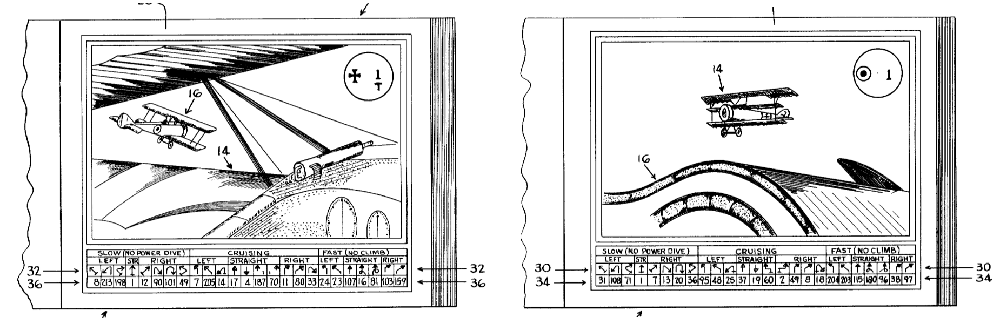

# Introduction

Voici la présentation que j'ai donnée aux Journées Perl 2018, le 18 mai 2018.
J'y ajoute certaines réflexions que l'assistance m'a faites lors de l'exposé.

Je cherchais un projet utilisant Perl 6 et MongoDB et qui puisse intéresser l'auditoire
des Journées Perl. J'ai donc exhumé des tréfonds
de ma mémoire une idée consistant à écrire un programme jouant à
l'[As des As](https://boardgamegeek.com/boardgame/798/ace-aces-handy-rotary-series).
Ce n'est que plus tard que j'ai constaté que ce projet pouvait bénéficier de
l'utilisation de Bailador (la version Perl 6 de Dancer2) et que cela me permettait
de célébrer le centenaire de la création de la RAF (1er avril 1918) et de la mort
de Manfred von Richthofen (21 avril 1918) ou, plus approximativement, la disparition
de Georges Guynemer (11 septembre 1917) et l'armistice (11 novembre 1918).

## Rappel

L'an dernier, j'ai présenté un système de reconnaissance
de caractères basé sur une interface entre un humain (fournissant
le moteur de reconnaissance de caractères) et une
machine (pour la base de données). J'aurais pu le présenter autrement.

_Copie d'écran personnelle. Les conditions de licence sont les mêmes que pour le texte._

\-- Maître, cette cellule contient un chiffre « 1 ».

\-- Petit Scarabée, c'est la lettre « l ».

\-- Ah, maître, je comprends la nature du « l ».

Présenté comme cela, vous avez reconnu, c'est du _machine learning_
ou plus précisément du _supervised machine learning_
(et ça fera bien dans mon CV).

## Cette année

Récemment, nous avons appris que Google avait fait du _supervised machine learning_
avec Google Alpha Go. Puis nous avons appris qu'ils avaient fait
une autre expérience sur le jeu de Go,
Google Alpha Go Zero, basé sur un mécanisme d'auto-apprentissage, ainsi
que l'équivalent pour les échecs, Google Alpha Chess Zero.
Le système ne connaît que les règles du jeu et le fait qu'une position
finale est gagnante ou perdante. Le système joue un grand nombre de
parties contre lui-même, analyse les résultats et en déduit les positions
et coups avantageux et les positions et coups foireux.

Cette idée ne date pas de 2017 ou 2018, je l'ai déjà rencontrée dans
les années 1970 avec un article décrivant une machine jouant au tic-tac-toe. Et depuis longtemps j'avais moi-même un projet
de « machine self-learning », que je vous présente ci-dessous. Et c'était le moment rêvé
de réaliser ce projet cette année, car 2018 c'est le centenaire de la création
de la RAF, de la mort au combat de Manfred von Richthofen et de l'armistice.

## Digression sur les précurseurs des liens hypertextes

Quand a-t-on commencé à numéroter les pages des livres (ou des rouleaux de papyrus) ?
Quand a-t-on écrit pour la première fois "cf. page n" ?
Quand a-t-on pensé à ajouter un index des mots importants en fin d'ouvrage ?
Quand a-t-on écrit un ouvrage qui utilise de façon _intensive_ les renvois
à une autre page ?

À la suite des travaux des naturalistes du XVIIIe siècle (Linné, Jussieu, Buffon, Cuvier, etc)
on a commencé à publier des flores, des livres décrivant l'ensemble des végétaux
d'une région ou d'un biotope. Mon père m'en a montré une datant des années 1950
et qui était organisée sous la forme d'une série de questions-réponses :

> Comment sont  les nervures  des feuilles ?  Si elles  sont parallèles,
> voyez page 17. Si elles forment un réseau arborescent avec une nervure
> centrale, des nervures primaires se  détachant de la nervure centrale,
> des nervures secondaires se détachant  d'une nervure primaire et ainsi
> de suite, voyez page 33.

Page 17 et page 33 vous aviez d'autres questions, d'autres réponses et d'autres renvois.

Années 1960 (je crois) : on m'a raconté qu'à cette époque IBM avait composé des
manuels de dépannage sur le même principe :

> Si de la fumée sort de l'unité  de disque, voyez page 17. Si cela fait
> « crrr crrr crrr » voyez page 33.

(Le texte est évidemment apocryphe, mais le principe est conservé.)

Dans les années 1970, j'ai vu à la télévision le sketch d'un duo d'humoristes
sur « le dictionnaire le plus petit du monde ». Ce qui prend de la place dans un dictionnaire
ce sont les définitions. Le personnage de l'un des humoristes avait pu
imprimer un dictionnaire au format de poche juste en éliminant les définitions.
Il expliquait à son interlocuteur avec un exemple ressemblant à :

> Clown : voir Cirque.        \
> Cirque : voir Cercle.       \
> Cercle : voir Club          \
> Club : voir Assemblée       \
> Assemblée : voir Parlement. \
> Parlement : voir Député.    \
> Député : voir Politicien.   \
> Politicien : voir Clown.

### Les Livres dont vous êtes le héros, Le Sorcier de la Montagne de Feu

En 1982, est paru un livre d'un genre nouveau,
[Warlock of the Firetop Mountain](http://fightingfantasy.wikia.com/wiki/The_Warlock_of_Firetop_Mountain_\(book\)),
bientôt traduit en français par
[Gallimard Folio Junior](http://planete-ldvelh.com/page/dossier-edition-gallimard.html)
sous le titre
« le Sorcier de la Montagne de Feu », le premier de la série
[« les Livres dont vous êtes le héros »](http://www.gallimard-jeunesse.fr/Catalogue/GALLIMARD-JEUNESSE/Un-Livre-dont-vous-etes-le-Heros).

> Paragraphe 1. Vous entrez dans une  auberge. Au fond de la salle, vous
> voyez l'aubergiste  à son  comptoir en train  d'essuyer des  verres. À
> gauche, dans  un recoin  sombre, un  homme seul à  une table,  la tête
> masquée  par un  capuchon noir.  Sur la  droite, une  demi-douzaine de
> nains des  montagnes boivent de  la bière en rigolant  bruyamment. Que
> faites-vous ? Vous  vous adressez à l'aubergiste,  allez au paragraphe
> 17.  Vous  vous asseyez  à  côté  de  l'homme encapuchonné,  allez  au
> paragraphe 33. Vous vous adressez aux nains en leur disant « Salut les
> ornements de jardin ! » allez au paragraphe 52.

J'en ai eu cinq, dont deux édités par Gallimard et trois par Solar, il m'en reste quatre.

_Photo personnelle. Les conditions de licence sont les mêmes que pour le texte._

# L'As des AS, le Jeu

En 1981, un dénommé Alfred Leonardi a déposé un brevet pour un
nouveau type de jeu, mis au point avec Douglas Kaufman. Au lieu de réunir les deux joueurs sur une même
carte où ils poussent des pions, chaque joueur est muni d'un livret.

_Photo prise par Chris Norwood et publiée sur [Boardgame Geek](https://boardgamegeek.com/image/1051809/ace-aces-handy-rotary-series?size=large).
Licence [Creative Commons Attribution 3.0 Unported, CC BY 3.0](https://creativecommons.org/licenses/by/3.0/)._

## Aperçu des règles

Le brevet donne un exemple de tour de jeu. Les deux joueurs commencent
le tour page 1. Dans les deux  livrets, cette page montre que les deux
avions ont le même cap et que le  Dr.I est dans les 4 heures du Camel,
c'est-à-dire que le Camel est dans les 10 heures du Dr.I.

_Copies d'écran provenant du brevet USP 4,378,118, dans le domaine public depuis 2001._

En bas de la page, vous pouvez remarquer une série de flèches et une
série de nombres, des numéros de page. Chaque joueur choisit une flèche et
annonce le numéro de page correspondant à son adversaire. Par exemple, le joueur
allemand choisit la flèche la plus à gauche dans la page et annonce :

\-- Je t'envoie en page 8.

Simultanément, le Britannique choisit la manœuvre en dessous de « EF »
« Cruising Left » et répond :

\-- Et toi, tu vas page 48.

_Copies d'écran provenant du brevet USP 4,378,118, dans le domaine public depuis 2001._

Le  joueur allemand  ouvre  son livret  page 48  et  applique la  même
manœuvre que précédemment, ce qui donne la page 96. De même, le joueur
britannique ouvre  son livret  page 8, repère  la manœuvre  choisie et
obtient le même numéro de page, 96.

_Copies d'écran provenant du brevet USP 4,378,118, dans le domaine public depuis 2001._

La page finale du tour est donc la page 96. Et comme vous pouvez le voir,
non seulement l'As des As est un précurseur des liens hypertextes, mais
c'est aussi un précurseur des jeux de tir en vision subjective
(_First Person Shooters_ en anglais), une douzaine d'années avant Wolfenstein 3D et Doom.

_Copies d'écran provenant du brevet USP 4,378,118, dans le domaine public depuis 2001._

Quant au mécanisme des tirs, c'est très simple. Vous commencez avec 12 points de vie.
Chaque fois que vous aboutissez sur une page finale où vous recevez des pruneaux de l'avion
ennemi, vous perdez 1, 2 ou 4 points de vie, selon la page finale. On ne tient pas
compte des pages intermédiaires. Quand votre total de points de vie
est négatif ou nul, votre avion est abattu.

## Dissection du mécanisme

Avec ce mécanisme, les pages finales sont toujours identiques. Cela émerveille les joueurs
qui découvrent le jeu, mais cela peut s'expliquer simplement. Oublions les cieux au-dessus
de [Poelcapelle](http://acepilots.com/wwi/fr_guynemer.html)
et de [Vaux-sur-Somme](http://military.wikia.com/wiki/Manfred_von_Richthofen),
et imaginons un parking de supermarché. Toutes
les voitures sont garées à proximité du bâtiment et il y a donc un large espace libre un
peu plus loin. Dans cet espace libre, se trouvent une Mini Austin et une VW Coccinelle
disposées ainsi (prenez les images en trait plein) :

_Image personnelle. Les conditions de licence sont les mêmes que pour le texte._
_Copie d'écran provenant du brevet USP 4,378,118, dans le domaine public depuis 2001._

Cela correspond à la page 1 des deux livrets.

Maintenant, imaginons que la VW fasse ce mouvement pendant que la Mini reste immobile.

_Image personnelle. Les conditions de licence sont les mêmes que pour le texte._
_Copie d'écran provenant du brevet USP 4,378,118, dans le domaine public depuis 2001._

On obtient alors la disposition de la page 8. À ce moment-là, la Coccinelle s'arrête
et l'Austin démarre en faisant ce mouvement

_Image personnelle. Les conditions de licence sont les mêmes que pour le texte._
_Copie d'écran provenant du brevet USP 4,378,118, dans le domaine public depuis 2001._

Le résultat est celui de la page 96.

_Image personnelle. Les conditions de licence sont les mêmes que pour le texte._
_Copie d'écran provenant du brevet USP 4,378,118, dans le domaine public depuis 2001._

Deuxième étape de l'expérience. Les deux voitures se remettent dans la disposition correspondant à la page 1.

_Image personnelle. Les conditions de licence sont les mêmes que pour le texte._
_Copie d'écran provenant du brevet USP 4,378,118, dans le domaine public depuis 2001._

Puis c'est la Mini qui bouge la première pendant que la VW reste immobile.
On aboutit alors à la disposition de la page 48.

_Image personnelle. Les conditions de licence sont les mêmes que pour le texte._
_Copie d'écran provenant du brevet USP 4,378,118, dans le domaine public depuis 2001._

Et lorsque la Coccinelle effectue son mouvement, on aboutit à la configuration de la page 96.

_Image personnelle. Les conditions de licence sont les mêmes que pour le texte._
_Copie d'écran provenant du brevet USP 4,378,118, dans le domaine public depuis 2001._

Troisième étape. Les voitures se remettent dans la position de la page 1, puis elles effectuent
_simultanément_ leur mouvement. Comme les deux fois précédentes, on obtient la disposition de
la page 96.

_Image personnelle. Les conditions de licence sont les mêmes que pour le texte._
_Copie d'écran provenant du brevet USP 4,378,118, dans le domaine public depuis 2001._

Ainsi donc, il est équivalent de faire les mouvements simultanément ou de les faire séquentiellement
dans un ordre ou dans l'autre. Et ce, aussi bien sur un parking de supermarché que dans
l'espace aérien de la Picardie ou des Flandres.

### Cas particulier, la page 223.

_Photo personnelle reprenant une page de Handy Rotary, copyright © 1986 Nova Game Designs, Inc., image copyright © 1986 Emithill limited_

Si vous consultez certains fichiers d'aide fournis par
[Boardgame Geek](https://www.boardgamegeek.com/boardgame/798/ace-aces-handy-rotary-series/files),
vous  verrez que  le  jeu de  base  sur une  grille  de 37  hexagones,
permettant  de générer  222 pages,  représentant toutes  les positions
relatives  des  deux avions  du  moment  qu'ils  sont à  une  distance
inférieure ou  égale à  trois hexagones.  Et que  se passe-t-il  si la
distance est supérieure ?  Si, du fait de leurs  manœuvres, les avions
se retrouvent plus  loin que cette distance limite,  le livret affiche
une  page spéciale,  la page  223 qui  représente des  nuages derrière
lesquels l'ennemi  a disparu.  Même si  cette page  montre le  ciel en
avant de l'avion, il est possible que l'ennemi ait disparu sur un côté
ou derrière.

Si un seul joueur  a une page intermédiaire à 223,  on utilise la page
intermédiaire de l'autre pour obtenir  la page finale. Impossible dans
ce cas de faire la vérification présentée, expliquée et démythifiée au
paragraphe  précédent. Un  tel cas  de figure  se produit  par exemple
lorsque les  deux avions se  poursuivent à grande  distance. Supposons
que nous soyons page  180, où le Camel est à  longue distance dans les
onze heures et demie du Dr.I et supposons que les deux avions avancent
tout droit à vitesse moyenne. Si l'on applique d'abord le mouvement du
Camel, le Dr.I le perd de  vue temporairement et la page intermédiaire
est la page 223, sur laquelle aucune manœuvre n'est indiquée.

_Image personnelle. Les conditions de licence sont les mêmes que pour le texte._

En revanche,  si l'on applique  d'abord la  manœuvre du Dr.I,  la page
intermédiaire est la  page 60 où le Camel est  à distance moyenne dans
les 11 heures du Dr.I.

_Image personnelle. Les conditions de licence sont les mêmes que pour le texte._

Puis on applique le  mouvement du Camel, ce qui donne  la page 180. Il
n'est plus possible  de vérifier que la page finale  est la même selon
les deux déterminations, mais tant pis.

_Image personnelle. Les conditions de licence sont les mêmes que pour le texte._

D'un autre côté, si les deux pages intermédiaires sont 223, ou bien si la page finale est
223, alors les avions se sont perdus de vue. Chaque joueur décide alors de continuer le
combat ou de s'éclipser. Si les deux avions fuient, c'est un match nul. Si les deux
avions décident de continuer, le combat reprend sur une page avec une position neutre, chaque avion
conservant les dégâts déjà subis. Si un seul avion fuit, il accorde une demi-victoire
à son adversaire, mais c'est parfois préférable, plutôt que de prendre le risque de se
faire descendre et d'accorder ainsi une victoire complète à son adversaire.

### Autre cas particulier, la poursuite

Lorsqu'un avion est dans le quadrant arrière d'un autre (4 à 8 heures)
et que son  cap est identique ou presque, alors  on dit qu'il poursuit
l'autre avion.  C'était le cas sur  la page 1 présentée  ci-dessus (et
aussi des pages  48 et 96, remarquez  le « T » sous le  numéro de page
dans le livret allemand). Pour  des raisons pédagogiques, j'ai préféré
faire le silence sur cette particularité. La simultanéité du choix des
manœuvres est partiellement annulée. La séquence est la suivante

1. L'avion poursuivi choisit une manœuvre.
2.  Il indique  au  poursuivant  s'il s'agit  d'une  manœuvre vers  la
gauche,  d'une manœuvre  vers la  droite  ou d'une  manœuvre en  ligne
droite  vers  l'avant.   Il  ne  donne  pas  le  numéro   de  la  page
intermédiaire.
3. L'avion poursuivant choisit une manœuvre.
4. Les deux joueurs annoncent simultanément les pages intermédiaires.
5. Les deux joueurs déterminent la page finale.

### Enchaînement des manœuvres

Si vous avez jeté un coup d'œil sur les aides de jeu fournies dans
[Boardgamegeek](https://www.boardgamegeek.com/boardgame/798/ace-aces-handy-rotary-series/files),
vous avez pu voir que lorsque le pilote  allemand va de la page 1 à la
page 8, sa vitesse est très faible et son mouvement reste en réalité à
l'intérieur de l'hexagone de départ. Une  fois, ça va, mais si l'avion
effectue une telle  manœuvre plusieurs fois d'affilée,  cela revient à
faire du  surplace. Pas  de problème s'il  s'agit d'un  colibri, d'une
alouette, d'un frelon, d'un drone ou d'une gazelle (non pas
[ce genre de gazelle](https://fr.wikipedia.org/wiki/Gazelle),
mais plutôt
[ce genre de gazelle](https://fr.wikipedia.org/wiki/Sud-Aviation_SA340/341/342_Gazelle))
mais  lorsqu'il s'agit  d'un Fokker  Dr.I  ou d'un  Sopwith Camel,  le
surplace est hors de question. Il  y a donc une règle optionnelle mais
fortement recommandée, empêchant de faire ce genre de manœuvre au tour
_n_ si l'avion en a déjà fait une au tour _n_-1.

Également,  il y  a les  manœuvres acrobatiques,  qui ne  peuvent être
effectuées au tour  _n_ que si l'avion a effectué  une manœuvre « tout
droit » au tour _n_-1.

### Altitude

Le jeu met en scène des avions, donc on tient compte de l'altitude, n'est-ce pas ?
Non, pour les règles de base, le jeu se contente
d'[utiliser deux dimensions](https://tvtropes.org/pmwiki/pmwiki.php/Main/TwoDSpace).
Il y a juste un cas où l'altitude a un rôle à jouer. Il y a six pages correspondant
au cas où les deux avions sont dans le même hexagone. Dans ce cas, on convient qu'il
sont séparés par quelques mètres d'altitude. C'est ce que disent les joueurs, la règle
est muette à ce sujet.

Il y a des règles avancées, dont une qui demande de noter l'altitude à
chaque tour  de jeu. C'est beaucoup  d'effort pour un gain  mineur, le
jeu n'en vaut pas la chandelle.  La seule règle optionnelle qui vaille
le coup, c'est la règle sur l'enchaînement des manœuvres.

### Considérations diverses

Lors d'un tour de jeu, vous devez garder à l'esprit :

1. le numéro de la page initiale,
2. la manœuvre choisie
3. la page intermédiaire que vous communiquez à votre adversaire,
4. la page intermédiaire que votre adversaire vous indique,
5. la page finale du tour,
6. le nombre de points de dégâts encaissés,
7. le type de manœuvre (normale, tout droit, acrobatique, basse vitesse) si vous utilisez la règle sur les enchaînements de manœuvres,
8. optionnellement le nombre de points de dégâts infligés à votre adversaire.

On  dit que  la mémoire  à  court terme  d'un  humain contient  7 ±  2
informations (à  part les  serveurs de  café, qui  dépassent largement
cette valeur).  À moins  d'être dans la  catégorie inférieure,  il est
possible de jouer à l'_As des As_  sans avoir besoin de noter quoi que
ce  soit, ni  de  déplacer  des marqueurs  sur  des  tableaux. Il  est
possible de jouer  à la plage, il  est possible de jouer à  côté de la
machine à café, il est possible  de jouer dans une salle d'attente, il
est possible de jouer dans le bus.  Et si vous êtes dans une catégorie
supérieure pour cette faculté, vous pouvez même jouer dans le bus tout
en gardant un œil sur les arrêts restants avant votre destination.

## Extensions

Deux extensions sont sorties avec des avions plus récents
(_[Powerhouse](https://boardgamegeek.com/boardgame/7104/ace-aces-powerhouse-series)_,
Spad XIII contre Fokker D.VII) ou plus anciens
(_[Flying Machines](https://boardgamegeek.com/boardgame/7103/ace-aces-flying-machines)_,
Airco DH2 contre Fokker E.III). Également, il y a la version Seconde Guerre Mondiale
(_[Wingleader](https://boardgamegeek.com/boardgame/6504/ace-aces-wingleader)_,
P-51 Mustang contre FW190), la version Guerre Froide
(_[Jet Eagles](https://boardgamegeek.com/boardgame/1991/ace-aces-jet-eagles)_,
F-15 Eagle contre MiG-29 Fulcrum) et
même la version Guerre des Étoiles
(_[Starfighter Battle Book](https://boardgamegeek.com/boardgame/3152/star-wars-starfighter-battle-book)_,
X-Wing contre TIE-Fighter, extension publiée par West End Games).

À remarquer que toutes ces versions ont la même pagination. Dans tous les livrets, la page 96 montre
le « méchant » derrière le « gentil », à distance moyenne, avec le même cap et en train de lui tirer dessus.
Il est possible de jouer avec un livret « gentil » d'un jeu et un livret « méchant » d'un autre jeu, quitte
à faire combattre un X-Wing contre un Fokker E.III ! Ou vous contenter d'un duel F-15 contre FW190,
ce qui vous rappelera le
[célèbre accrochage](https://www.youtube.com/watch?v=f3XNEWtJF0o)
entre deux F-14 et deux A6M2 Zéro.

Juste quelques hics, l'échelle des distances n'est pas la même d'un jeu à l'autre et les
points de dégâts n'ont rien à voir. Il vous faudra une bonne dose de
[suspension délibérée de l'incrédulité](http://tvtropes.org/pmwiki/pmwiki.php/Main/WillingSuspensionOfDisbelief)
pour les parties de ce type !

Et vous ne pouvez pas opposer un « gentil » à un autre « gentil », par exemple un F-15 à un P-51,
ni faire combattre un « méchant » avec un autre « méchant », par exemple un Fokker D.VII
contre un FW190.

Attention au sujet de _Wingleader_ : il existe un
[autre jeu](https://boardgamegeek.com/boardgame/160418/wing-leader-victories-1940-1942)
beaucoup plus récent du
même nom chez GMT. Si vous êtes intéressé par le jeu décrit et que vous voulez l'acheter
par correspondance, vérifiez bien qu'il s'agit du bon jeu.

_Photos personnelles. Les conditions de licence sont les mêmes que pour le texte._

_Photos personnelles reprenant une page dans les deux livrets de Jet Eagles, copyright © 1990 Nova Game Designs, Inc._

Toutes  ces variantes  proposent également  des règles  avancées, pour
l'altitude  par exemple,  ou le  jeu  2-contre-2, ou  encore pour  les
radars et les missiles dans le  cas de _Jet Eagles_. Hélas, ces règles
avancées font  perdre la compatibilité  avec la capacité  7 ± 2  de la
mémoire à  court terme. À  part une  règle sur la  compatibilité entre
deux manœuvres successives d'un même avion, je n'ai pas l'intention de
les prendre en compte dans mes programmes.

Il y a également une extension
_[Balloon Buster](https://boardgamegeek.com/boardgame/5736/ace-aces-balloon-buster)_
où l'on fait du 2-contre-1. Le joueur allemand contrôle un ballon d'observation
(assez passif) plus un canon anti-aérien, contre un avion britannique.

Autres extensions dans la même lignée, mais impossibles à mélanger avec les premières :
_[Shootout at the Saloon](https://boardgamegeek.com/boardgame/3089/bounty-hunter-shootout-saloon)_
traduit chez Gallimard avec le titre _Le shérif et le hors-la-loi_,
_[Dragons Riders of Pern](https://boardgamegeek.com/boardgame/5735/dragonriders-pern-book-game)_
traduit par Gallimard avec le titre _les Maîtres des Dragons_
et une série dont je n'avais jamais entendu parler avant de rédiger ces explications,
_[Lost Worlds](https://boardgamegeek.com/boardgame/3969/lost-worlds-adventure-set-i-ruins-ancients)_.

_Photos personnelles reprenant « Le Shérif et le Hors-la-loi », Copyright © 1982 Nova Games Design Inc, copyright © 1986 Emithill Limited,
copyright © 1986 Gallimard pour la traduction française et pour les illustrations de couverture._

    
    

_Photos personnelles reprenant le jeu "Mai 68" de F. Nédelec et D. Vitale, Copyright © 1980, 1982, 1988_

Oups ! Qu'est-ce que cela vient faire dans cet exposé sur le centenaire de la RAF et sur
le centenaire de l'armistice ? Est-ce que Danny le Rouge a évincé le Baron Rouge ?

Pour en revenir au combat aérien, puisque le brevet est tombé dans le domaine public,
n'importe qui peut publier des extensions dans la lignée :

- Apache AH-64 vs Mi-24 Hind
- Quidditch : Griffindor vs Slytherin
- Superman vs Ironman
- Épervier vs drone de loisir

C'est d'ailleurs cette dernière extension que j'ai choisie pour disposer de données
de tests dans mes programmes. J'étais réticent à reprendre les caractéristiques des
avions de l'un des jeux existants, car si le brevet est expiré, le copyright ne l'est pas.

# L'As des As, description des programmes

Lorsque j'ai découvert  le jeu, je me suis dit  que finalement, ce jeu
consistait  à  combiner des  nombres  (les  numéros  de page)  et  des
symboles  (les  manœuvres)  pour  obtenir  d'autres  nombres.  L'image
figurant sur chaque page a pour but d'aider le joueur humain à choisir
le  bon symbole  de  manœuvre, du  moment  que ce  joueur  a une  idée
suffisamment  précise du  vol d'un  avion et  qu'il connaît  les Dicta
Boelke, les conseils de Sailor Malan, l'ouvrage _No Guts, No Glory_ de
« Boots »  Blesse et  autres écrits  du  même genre.  Il est  possible
d'enlever tout  cet habillage  aéronautique pour  ne conserver  que le
mécanisme   abstrait  reposant   sur   un  automate   à  états   finis
éventuellement  mâtiné d'une  dose de  fonction _random_.  D'où l'idée
d'un programme jouant  à ce jeu sans rien connaître  du contexte réel,
mais  se basant  uniquement sur  une analyse  statistique des  parties
passées.

Il  y  a  deux  grandes  parties dans  le  projet.  Tout  d'abord,  la
[préparation](#préparation),  consistant à  produire les  livrets sous
forme électronique,  en générant les  fichiers plutôt qu'en  tapant la
totalité des  enchaînements entre pages et  manœuvres. Puis il y  a le
[jeu](#jeu) proprement  dit où  des programmes combattent  l'un contre
l'autre et  tirent la  leçon de  leurs combats  passés. Mais  avant de
décrire dans  le détail  les programmes,  voici les  instructions pour
installer le projet sur votre machine.

## Installation

Je  décris ici  l'installation  du projet  sur  une machine  virtuelle
[xubuntu](https://xubuntu.fr/) 21.04 "Hirsute Hippo". Je ne vous donne
pas des instructions à suivre à  la lettre, juste un canevas dont vous
pourrez  vous inspirer  pour  votre installation.  Si  vous avez  déjà
installé  Raku ou  MongoDB  sur  votre machine,  ou  si votre  machine
utilise  une autre  distribution Linux,  voire un  autre système  Unix
comme FreeBSD, il  y aura des différences, mais  l'idée générale reste
la même.  Évidemment, si  vous souhaitez installer  le projet  sur une
machine Windows, les différences seront beaucoup plus importantes.

Mais tout d'abord, un avertissement.

### Considérations sur la sécurité

Ce projet est  un projet récréatif et ludique. Il  n'est pas destiné à
traiter des  données cruciales. Si  le contenu  de la base  de données
fuite vers  l'extérieur, cela  n'a aucune importance  pour moi.  Si le
contenu de la base de données  est altéré par l'intrusion d'un pirate,
c'est un désagrément mineur.

J'adopte donc un  modèle de sécurité assez léger :  la base de données
est accessible  uniquement sur la machine  qui l'héberge (`localhost`
ou `127.0.0.1`). Si quelqu'un est connecté sur cette machine, il peut
accéder sans  aucun problème  à la  base de données.  Il n'y  a aucune
mesure supplémentaire d'authentification.

Si vous souhaitez utiliser MongoDB  pour stocker vos relevés bancaires
et vos examens médicaux, il est évident que vous devrez revoir de fond
en comble le paramétrage de la base de données. Mais c'est hors de mon
propos.

Autre  sujet, voisin  de la  sécurité, les  performances. Le  site web
permettant  de présenter  les parties  passées de  façon agréable  est
d'une lenteur désespérante. Tant que je suis le seul utilisateur de ce
site web, cela ne  pose pas de problème. Et c'est le  cas parce que je
n'ai pas  défini de  serveur web  sur ma machine  qui soit  visible de
l'extérieur.  Si votre  machine  comporte  un serveur  web  et que  ce
serveur permet  d'afficher les parties  de l'As des  As de la  base de
données pour des requêtes extérieures, votre machine se mettra à ramer
et vous pourriez même avoir  l'équivalent d'un déni de service (_DOS_
ou _DDOS_).

Finalement, je  n'ai pas cherché  à faire quelque chose  de "packagé",
avec un  fichier configuration global  dans le répertoire  `/etc`, un
fichier de  configuration personnalisé  dans `$HOME`  et dont  le nom
commence par un point. Tout se fait dans le répertoire du dépôt Git et
ses sous-répertoires : programmes exécutables, fichiers de paramètres,
fichiers  résultats, etc.  Vous  pouvez même  être  amenés à  modifier
certains  programmes  pour  vos   besoins.  Par  exemple,  le  fichier
`launch` lance  une partie  entre un épervier  générique et  un drone
générique. Si vous voulez une  partie entre Plume-Noire et Kévin, vous
devrez éditer le fichier `launch` pour inhiber certaines lignes et en
réactiver d'autres.

### Définition de la machine

Si  vous utilisez  une machine  virtuelle, pensez  à lui  attribuer au
moins   2048    Mo   de   mémoire   vive.    La   [documentation   de
Rakudo](https://rakudo.org/downloads/rakudo/source)  demande   1,5  Go,
j'arrondis à 2  Go. La machine virtuelle doit également  avoir accès à
Internet.

### Installation de logiciels extérieurs

Avec  le gestionnaire  de paquets  de la  distribution (`apt-get`  ou
_Synaptic_ dans le cas de xubuntu), installez
[Emacs](https://www.gnu.org/software/emacs/),
[Git](https://git-scm.com/),
[curl](https://curl.se/)
et la bibliothèque `libssl-dev`.

Et vérifiez que vous avez bien [GnuPG](https://gnupg.org/).

Pour  Emacs,  c'est  une  préférence  personnelle.  Si  vous  préférez
[vim](https://www.vim.org/)  ou  [nano](https://www.nano-editor.org/),
libre à vous de les installer.  En revanche, les autres logiciels sont
absolument nécessaires.

### Installation de Rakudo

À la  différence de  mon installation de  2018, décrite  au paragraphe
["Compilation et installation  de Raku"](#compilation-et-installation-de-raku), la version  de xubuntu est
toute récente, avec par conséquent un paquet Perl6 et un paquet Rakudo
assez récents,  puisqu'il s'agit de  Perl 6.d.3 et de  Rakudo 2020.12.
J'ai donc  installé les paquets  par Synaptic,  je n'ai pas  cherché à
compiler les sources.

Si vous voulez compiler à partir  des sources, veuillez vous référer à
ce paragraphe ["Compilation et installation de Raku"](#compilation-et-installation-de-raku).

Parmi  les paquets  automatiquement chargés  avec Perl  6, il  y a  le
paquet perl6-zef. Donc  vous n'avez pas à  vous préoccuper d'installer
`zef`.   Sur  d'autres   systèmes,  vous   pouvez  avoir   un  script
`install-zef`.  Il faut  bien entendu  le lancer.  Sinon, suivez  les
instructions dans le
[dépôt Github de zef](https://github.com/ugexe/zef).

À noter  une mésaventure  qui m'est  arrivée ultérieurement  sur cette
machine  virtuelle  :  j'ai  voulu  tester  l'accès  à  SQLite  par
l'intermédiaire du
[module DBIish](https://github.com/raku-community-modules/DBIish).
L'installation de `DBIish` par `zef` a planté, parce qu'il n'y avait
pas de compilateur C. Donc, en plus de Git et `curl` déjà mentionnés,
pensez à installer `gcc`, `binutils` et `make`.

### Installation de modules Rakudo

Dans le but de pouvoir prendre  un instantané (snapshot) de la machine
virtuelle  au bon  moment, j'ai  installé  tout de  suite les  modules
nécessaires  pour  MongoDB et  pour  le  site web,  avant  d'installer
MongoDB. L'installation  se fait par  `zef`. Les modules  à installer
sont :

- OpenSSL
- Semaphore::ReadersWriters
- HTTP::UserAgent
- Auth::SCRAM
- Config::DataLang::Refine
- BSON
- Log::Async
- Terminal::ANSIColor
- Digest::MD5
- Bailador
- Template::Anti

Notons  que   lors  de   l'installation  de   Bailador,  le   test  de
`HTTP::Supply`  produit  un  avertissement.  Mais  c'est  normal  (cf
[https://github.com/zostay/HTTP-Supply/issues/5](https://github.com/zostay/HTTP-Supply/issues/5)).  Pour  `Template::Mojo` et
`Bailador`, il  y a eu d'autres  erreurs que je  n'ai pas eu le  temps de
noter. De toute façon, ces erreurs ne sont pas bloquantes.

Si   vous  n'êtes   pas  intéressés   pour  prendre   des  instantanés
régulièrement,  vous pouvez  vous  contenter  d'installer Bailador  et
Template::Anti, tout  le reste  sera automatiquement installé  par zef
lorsque vous demanderez l'installation du module MongoDB.

### Installation de MongoDB

Si  la  récente version  "Hirsute  Hippo"  de xubuntu  m'a  énormément
simplifié l'installation de Rakudo, en  revanche elle m'a compliqué la
tâche pour l'installation de MongoDB.  En effet, le dépôt xubuntu pour
"Hirsute Hippo"  ne contient aucun  paquet pour les  serveurs MongoDB,
uniquement pour des clients.

Si  vous avez  la  chance de  disposer de  paquets  pour installer  un
serveur MongoDB  sur votre  distribution, tant mieux,  installez-le et
passez  directement  au
[paragraphe suivant](#installation-du-module-mongodb).

Le  [site   de  MongoDB](https://www.mongodb.com/fr)  ne   décrit  pas
l'installation  de MongoDB  pour la  version 2021.04  "Hirsute Hippo",
mais seulement pour les versions LTS (16.04, 18.04 et 20.04). De plus,
c'est  la  distribution  de  base  _Ubuntu_,  pas  les  distributions
dérivées _Kubuntu_  ou _xubuntu_.  Néanmoins, j'ai  fait l'hypothèse
que  "xubuntu-21.04" était  assez semblable  à "Ubuntu-20.04"  et j'ai
suivi les instructions correspondantes.

Prière de vous référer à la
[page d'installation](https://docs.mongodb.com/manual/tutorial/install-mongodb-on-ubuntu/)
fournie par  MongoDB, pour  avoir les instructions  à jour.  Pour vous
donner une idée, voici ce que j'ai dû faire :

Importer la clé PGP de MongoDB :

    wget -qO - https://www.mongodb.org/static/pgp/server-4.4.asc | sudo apt-key add -

Ajouter le dépôt  20.04 "Focal Fossa" de MongoDB en  espérant que cela
conviendra à 21.04 "Hirsute Hippo" :

    echo "deb [ arch=amd64,arm64 ] https://repo.mongodb.org/apt/ubuntu focal/mongodb-org/4.4 multiverse" | sudo tee /etc/apt/sources.list.d/mongodb-org-4.4.list

Rafraîchir la liste des paquets :

    sudo apt-get update

Installer MongoDB :

    sudo apt-get install -y mongodb-org

(ce qui me change du clickodrome Synaptic).

Déclarer que le serveur MongoDB devra être lancé à chaque démarrage de la machine :

    sudo systemctl enable mongod

Et soit redémarrer la machine immédiatement, soit lancer MongoDB avec :

    sudo systemctl start mongod

Également, pour la sécurité, vérifier que la base de données n'est pas
accessible de  l'extérieur. Pour ceci,  consulter `/etc/mongodb.conf`
et vérifier que le fichier contient bien :

    bind_ip = 127.0.0.1
    #port = 27017

### Installation du module MongoDB

Première idée, taper :

    zef install MongoDB

Mauvaise  idée,  le  test  `t/099-start-servers` plante  et  le  test
`t/200-Database.t`  boucle. Il  faut donc  interrompre l'installation
avec `Ctrl-C` et recommencer.

J'ai donc effectué :

    git clone https://github.com/MARTIMM/mongo-perl6-driver.git
    cd mongo-perl6-driver
    zef --/test install .

(N'oubliez pas le point à la fin de la ligne de commande.)

Ultérieurement, je me suis contenté de taper :

    zef --/test install MongoDB

Reconnaissons  que  même s'il  reste  quelques  bugs, la  situation  a
beaucoup progressé depuis mars 2018, lorsque j'ai tenté d'installer le
module pour la première fois.

### Installation du projet pour l'As des As

Récupérez mes œuvres avec :

    git clone https://github.com/jforget/Perl6-Alpha-As-des-As-Zero.git

Puis effectuez quelques initialisations :

    cd Perl6-Alpha-As-des-As-Zero/Game
    ./init-aircraft.raku Epervier
    ./init-aircraft.raku Drone
    ./init-pilot.raku    Kevin
    ./init-pilot.raku    Plume-Noire

Et alors vous  êtes prêts à lancer des parties  entre l'épervier et le
drone avec :

    ./launch

En  désactivant  certaines  lignes  de  `launch`  avec  un  dièse  et
réactivant  d'autres  lignes, vous  pouvez  lancer  des parties  entre
Plume-Noire l'épervier et Kévin l'utilisateur de drone.

Ensuite, vous lancez le serveur Bailador :

    raku website.raku

et vous  consultez les parties déjà  jouées dans un navigateur  web en
demandant au choix :

    http://localhost:3000
    http://localhost:3000/fr/list

Pour arrêter  le serveur web, faire  `Ctrl-C` sur la fenêtre  où vous
l'avez lancé.

### Extension aux véritables jeux de l'As des As

Pour jouer  avec les véritables  protagonistes des jeux de  l'_As des
As_,  il faut  utiliser les  programmes du  répertoire `Preparation`.
Initialisez la base de données `aoa_prep` avec :

    raku init.p6
    sh maj1

Ensuite, pour chaque avion, tapez  un fichier d'initialisation dans le
répertoire `Preparation/fr` ou `Preparation/en`. La différence entre
ces  deux répertoires  est que  les mots-clés  sont respectivement  en
français et  en anglais.  À part cela,  les fichiers  sont identiques.
Voici  l'exemple  pour  un  épervier,  avec  des  mots-clés  français,
c'est-à-dire le fichier `Preparation/fr/Epervier-init.json`.

    {
      "livret":   "Test",
      "camp":     "G",
      "identité": "Epervier",
      "nom":      "Epervier",
      "capacité": 12,
      "manoeuvres": {
          "A": { "chemin": "0;5" , "virage": "G", "vitesse": "1" }
        , "B": { "chemin": "0;0" , "virage": "A", "vitesse": "1" }
        , "C": { "chemin": "0;1" , "virage": "D", "vitesse": "1" }
        , "D": { "chemin": "00;5", "virage": "G", "vitesse": "2" }
        , "E": { "chemin": "00;0", "virage": "A", "vitesse": "2" }
        , "F": { "chemin": "00;1", "virage": "D", "vitesse": "2" }
      },
      "tirs": {
          "187": "4"
        , "188": "4"
        , "198": "4"
        , "205": "4"
        , "209": "4"
        , "213": "4"
      }
    }

Prenons  comme  exemple  le  fichier  `Preparation/fr/DR1-init.json`,
décrivant le Fokker DR.1 de _Handy Rotary_.

Le nom sera quelque chose comme « Fokker DR.1 ». L'identité sera
une version simplifiée, de nature à s'intégrer sans peine dans un URI.
En  d'autres  termes,  il  faut  éviter  les  `%20`,  les  `%27`  et
similaires et ne  conserver que des lettres, des  chiffres, des tirets
et  des points,  alors  que le  nom peut  sans  problème contenir  des
espaces et des apostrophes. La première version du fichier sera donc :

    {
     "identité": "DR1",
     "nom":      "Fokker DR.1",
    }

On  y ajoute  le nom  du livret  origine (bien  que cela  ne soit  pas
utilisé dans les programmes).

    {
     "identité": "DR1",
     "nom":      "Fokker DR.1",
     "livret":   "Handy Rotary",
    }

Le Fokker est-il  un gentil ou un  méchant ? Voyez page 2  ou page 16.
Sur la page 2, le méchant est en  train de tirer sur le gentil, sur la
page 16  le gentil est  en train de tirer  sur le méchant.  Dans notre
cas, le Fokker est donc dans le camp des méchants, ce qui donne :

    {
     "identité": "DR1",
     "nom":      "Fokker DR.1",
     "livret":   "Handy Rotary",
     "camp":     "M",
    }

Pour le gentil, cela aurait été :

    "camp":     "G",

À cela, nous ajoutons la capacité initiale en points de dégâts :

    {
     "identité": "DR1",
     "nom":      "Fokker DR.1",
     "livret":   "Handy Rotary",
     "camp":     "M",
     "capacité": 12,
    }

Puis feuilletez  le livret, en  notant chaque page  où le DR.1  est en
train  de tirer  sur son  adversaire. Pour  chaque page,  inscrivez le
numéro de la page et le nombre de points de dégâts infligés :

    {
     "identité": "DR1",
     "nom":      "Fokker DR.1",
     "livret":   "Handy Rotary",
     "camp":     "M",
     "capacité": 12,
     "tirs": {
           "2": "4"
       ,   "8": "4"
            [ ... ]
       ,  "96": "2"
            [ ... ]
       , "143": "1"
     }
    }

Nous voici arrivés à la partie  la plus délicate, les manœuvres. Je me
limiterai ici aux deux manœuvres prises comme exemples dans le brevet.
Tout d'abord, attribuez un code  à chaque manœuvre. Pour _Wingleader_,
pour _Jet  Eagles_ et pour  certaines éditions de _Handy  Rotary_, les
codes  sont déjà  attribués,  mais  pour les  autres  jeux, il  faudra
attribuer des  codes `A` jusqu'à  ... (jusqu'à `M`  pour _Wingleader_,
jusqu'à `Y` pour _Handy Rotary_ et _Jet Eagles_).

Ainsi donc, les manœuvres du brevet sont les manœuvres **A** et **J**.
Ce qui nous donne :

    "manoeuvres": {
        "A": { "chemin": "?" , "virage": "?", "vitesse": "?" }
      , "J": { "chemin": "?" , "virage": "?", "vitesse": "?" }
    },

En regardant la ligne du haut dans le tableau des manœuvres, on trouve
la  vitesse :  _slow_  (lent)  pour la  manœuvre  **A** et  _cruising_
(vitesse de croisière) pour la manœuvre **J**. Cela se traduit par :

    "manoeuvres": {
        "A": { "chemin": "?" , "virage": "?", "vitesse": "0" }
      , "J": { "chemin": "?" , "virage": "?", "vitesse": "1" }
    },

En fait, la vitesse ne sert pas à grand chose. Mais elle était là dans
les livrets du jeu, je l'ai reprise dans les fichiers init.

La deuxième ligne donne la direction du virage : à gauche, en avant ou
à droite (respectivement _left_ _straight_ et _right_). À l'inverse de
la vitesse, c'est  une donnée importante, utilisée pour  les règles de
poursuite (_tailing_). Dans notre cas, les deux manœuvres vont vers la
gauche. Cela nous donne :

    "manoeuvres": {
        "A": { "chemin": "?" , "virage": "G", "vitesse": "0" }
      , "J": { "chemin": "?" , "virage": "G", "vitesse": "1" }
    },

Pour le  chemin, nous ouvrons  le livret à  la page 187.  Depuis cette
page, la  manœuvre **A** nous  renvoie page  205 et la  manœuvre **J**
nous renvoie  page 23. Consultons  les lignes correspondantes  dans le
fichier `Preparation/etape-finale.html`

| 23  | 5;5 | 3;1 | A 30  | ... |
|-----|-----|-----|-------|-----|
| 205 | ;5  | ;1  | A 213 | ... |

Puisque nous nous occupons d'un  méchant, il faut regarder la deuxième
colonne. Elle nous donne la formule  du chemin, que nous insérons dans
la spécification des manœuvres :

    "manoeuvres": {
        "A": { "chemin": ";5"  , "virage": "G", "vitesse": "0" }
      , "J": { "chemin": "5;5" , "virage": "G", "vitesse": "1" }
    },

Notons que pour la page 187 du Camel, la manœuvre **A** aurait conduit
à la page 198 et la manœuvre **J**  à la page 31. Pour ces deux pages,
le fichier `etape-finale.html` file nous donne :

| 31  | 3;1 | 5;5 | A 2   | ... |
|-----|-----|-----|-------|-----|
| 198 | ;1  | ;5  | A 187 | ... |

Pour un "gentil",  il faut consulter la troisième  colonne. Comme vous
pouvez le voir, nous obtenons les mêmes formules `5;5` et `;5`.

Le document final est donc :

    {
     "identité": "DR1",
     "nom":      "Fokker DR.1",
     "livret":   "Handy Rotary",
     "camp":     "M",
     "capacité": 12,
     "manoeuvres": {
         "A": { "chemin": ";5"  , "virage": "G", "vitesse": "0" }
            [ ... ]
       , "J": { "chemin": "5;5" , "virage": "G", "vitesse": "1" }
            [ ... ]
     },
     "tirs": {
           "2": "4"
       ,   "8": "4"
            [ ... ]
       ,  "96": "2"
            [ ... ]
       , "143": "1"
     }
    }

Si vous préférez,  vous pouvez composer ce fichier  avec des mots-clés
anglophones et le stocker dans `Preparation/en/DR1-init.json` au lieu
de `Preparation/fr/DR1-init.json`. Cela donne :

    {
     "identity": "DR1",
     "name":     "Fokker DR.1",
     "booklet":  "Handy Rotary",
     "side":     "B",
     "capacity": 12,
     "maneuvers": {
         "A": { "path": ";5"  , "turn": "L", "speed": "0" }
            [ ... ]
       , "J": { "path": "5;5" , "turn": "L", "speed": "1" }
            [ ... ]
     },
     "shoots": {
           "2": "4"
       ,   "8": "4"
            [ ... ]
       ,  "96": "2"
            [ ... ]
       , "143": "1"
     }
    }

Dans tout cela, faites attention  aux virgules séparant les différents
attributs. Vous remarquerez que j'ai mis les tirs en dernière position
et sans virgule, même si j'ai  terminé par la liste des manœuvres, qui
possède une virgule et qui a été insérée en avant-dernière position.

Il ne reste plus qu'à faire :

    raku livret.p6 DR1
    cp en/DR1.json ../Game
    cd ../Game
    ./init-aircraft.raku DR1

Notons  que `init-aircraft.raku`  attend  des mots-clés  anglophones,
c'est pour cela que l'on prend le fichier du sous-répertoire `en`. Le
sous-répertoire `fr` contient  un fichier JSON avec  des mots-clés en
français, utilisable  pour les  programmes du répertoire  `Jeu`. Seul
problème, les programmes de ce répertoire ne sont plus maintenus.

Les  deux sous-répertoires  `en`  et `fr`  contiennent également  un
fichier `DR1.html` qui présente les  mêmes données, mais plus faciles
à lire que dans le format JSON.

Ensuite, faites  de même avec  le Sopwith Camel.  Pour les jeux  de la
série  _As des  As_, à  l'exception du  _Starfighter Battle  Book_, il
existe un raccourci dans la mesure  où ces jeux sont symétriques. Vous
pouvez  ainsi copier-coller  la liste  des manœuvres.  Il vous  faudra
malgré tout passer en revue le  livret Camel pour déterminer les pages
de tir.

Une fois que vous avez fait ceci,  il ne reste plus qu'à mettre à jour
le fichier `launch` (ou le  dupliquer puis l'adapter) pour lancer des
parties entre  un Camel  anonyme et  un DR.1  anonyme (voire,  si vous
aimez l'absurde,  un combat entre  un Camel et  un drone, ou  entre un
épervier et un DR.1).

Enuite, tapez des fichiers init pour quelques pilotes, en vous basant sur
l'exemple ci-dessous.

    {
      "identity": "Manfred",
      "name": "Manfred von Richthofen",
      "aircraft": "DR1",
      "perspicacity": 0.6,
      "stiffness": 2.718,
      "hits": 12,
      "ref": [ "DR1" ]
    }

Comme pour les avions, l'attribut `name` est un nom destiné à être lu
par un  humain, avec si  nécessaire des espaces, des  apostrophes etc.
tandis que l'attribut `identity` est  un nom compatible avec les URI,
donc  sans caractères  spéciaux tels  que  les `%20`  et les  `%27`.
L'attribut  `aircraft`  est  l'attribut `identity`  de  l'avion  sur
lequel  le  pilote  vole.  L'attribut `perspicacity`  est  un  nombre
flottant  entre  0 et  1  et  l'attribut  `stiffness` est  un  nombre
flottant supérieur à  1. Leur utilisation est expliquée  dans la suite
de ce  document. Et  l'attribut `ref`  est une  liste d'avions  et de
pilotes. Cet  attribut n'est  pas exploité par  les programmes  de jeu
pour l'instant.

Une fois le fichier terminé, lancez

    ./init-pilot.raku Manfred

en supposant que le fichier s'appelle `Manfred.json`. Puis adaptez le
script  `launch` pour  permettre le  lancement de  parties entre  des
pilotes connus.

En fait, les fichiers `Manfred.json` et `Roy.json` sont publiés dans
le répertoire `Game`, parce qu'il ne contiennent rien qui soit soumis
au copyright. Vous  pouvez les modifier ou les utiliser  comme base de
départ pour des fichiers initialisant d'autres joueurs.

## Préparation

J'ai commencé par programmer cette partie, bien sûr. Je l'ai faite avant d'initialiser
le dépôt Git. Du coup, les programmes étaient dans un répertoire extérieur.
Ces programmes ont été réintégrés après coup dans le dépôt Git, avec une
phase de nettoyage. Vous ne verrez donc pas mes tout premiers pas en Perl 6.

Les  programmes  de  ce  dossier   tiennent  compte  de  la  géométrie
sous-jacente des  pages. Dans un  premier temps,  en se basant  sur un
seul livret  de la série,  on cherche à retrouver  l'interprétation de
chaque  page  sur la  grille  hexagonale  implicite. On  commence  par
charger la  base de données  avec une page  codée « en dur »,  plus la
page spéciale  223. Ensuite, le  processus est itératif. On  prend une
page  déjà référencée  dans la  base de  données, puis  on fournit  au
programme la liste des transitions manœuvres → page d'arrivée de cette
page de  départ. Cela permet  de définir à  quel hexagone et  à quelle
orientation ces  pages d'arrivée  correspondent. Au bout  d'un certain
temps, on  a passé  en revue  toutes les  pages du  livret et  donc on
connaît la grille hexagonale entière.

Dans  un  deuxième temps,  on  initialise  un  fichier JSON  avec  les
manœuvres d'un avion, on croise avec la base de données de la première
étape, et on génère un livret donnant la liste des transitions page de
départ + manœuvre  → page d'arrivée. Ce livret est  codé sous la forme
d'un fichier JSON avec en prime un fichier HTML.

Vous en saurez plus en lisant la
[documentation](https://github.com/jforget/Perl6-Alpha-As-des-As-Zero/blob/master/Preparation/description-fr.md)
particulière de cette étape.

## Jeu

Le jeu entre humains est prévu pour deux joueurs sans arbitre.
Pour les programmes, j'ai préféré utiliser un programme arbitre,
ou plutôt un processus arbitre,
communiquant avec deux processus joueurs. Les deux processus
joueurs fonctionnent avec le même programme Perl 6, mais avec des
arguments d'appel différents.

Pour rester  dans la même optique  que Google Alpha Go  Zero et Google
Alpha  Chess  Zero,  le   programme  joueur  n'a  aucune  connaissance
intrinsèque des mécanismes  de vol et des doctrines  de combat aérien.
Il se contente  de recevoir une liste de manœuvres  de l'arbitre, d'en
sélectionner une et de renvoyer la réponse à l'arbitre.

Le  programme  joueur  fonctionne  en  deux modes.  Il  y  a  le  mode
entraînement où le  choix est totalement aléatoire. Et il  y a le mode
combat  où le  programme  joueur extrait  de la  base  de données  les
situations analogues  pendant les  parties précédentes pour  savoir ce
qui  a bien  marché et  ce qui  n'a pas  donné de  bons résultats.  Il
attribue  des  probabilités  plus  ou moins  élevées  aux  différentes
manœuvres proposées  par le  programme arbitre et  tire au  hasard une
manœuvre, en tenant compte de la loi de probabilité attribuée.

J'ai  choisi une  méthode aléatoire  pour le  choix des  manœuvres, de
manière  à éviter  d'aboutir  à un  jeu  stéréotypé, chaque  programme
joueur faisant  un calcul de  minimax sur les manœuvres  pour toujours
obtenir  le  même  choix  dans  la  même  situation.  Avec  un  tirage
aléatoire,  la  meilleure solution  est  celle  qui  a la  plus  forte
probabilité, mais cela  n'exclut pas de temps en temps  de choisir une
manœuvre inhabituelle « pour  dérouter l'adversaire » (non, l'argument
est foireux dans le cas d'un combat programme contre programme).

Le programme arbitre, lui, a une meilleure connaissance des mécanismes
de vol et de tir, mais rien  sur la tactique ni la doctrine. C'est lui
qui lit le fichier JSON créé  par les programmes de préparation et qui
connaît  ainsi à  quelle page  on aboutit  lorsque l'on  exécute telle
manœuvre  sur telle  page de  départ. Ce  qui ne  veut pas  dire qu'il
connaît  la  géométrie  sous-jacente,  il se  contente  d'utiliser  le
fichier JSON comme une table de  transitions page de départ + manœuvre
→ page d'arrivée.

### Base de données

Le choix de la base de données
[MongoDB](https://www.mongodb.com/fr)
s'appuie sur les mêmes raisons que celles
que j'ai données lors de ma présentation aux Journées Perl 2017. J'en sais déjà
suffisamment sur les manipulations de données en SQL, alors que j'ai plus à découvrir
avec les bases NoSQL. Il aurait été possible d'écrire les programmes avec une base
de données
[SQLite](https://sqlite.org/index.html)
ou une autre base SQL, mais je trouvais cela moins intéressant.

Lors de ma présentation, on m'a fait remarquer que MongoDB permet de stocker des
images, ce qui est intéressant pour un jeu tel que l'As des As, basé sur des images
représentant des avions. Le stockage des images n'a pas joué dans mon choix de MongoDB.
Je n'ai jamais eu l'intention de recopier les images dans la base de données.

Notons que certaines données sont  stockées dans un fichier texte avec
la  syntaxe  JSON :  les  caractéristiques  des avions.  Au  début,
c'était  la même  chose  pour  les pilotes,  qui  figuraient dans  des
fichiers  JSON. Puis  je  me suis  dit que  c'était  plus facile  dans
certains cas si les pilotes étaient  stockés dans une collection de la
base MongoDB,  en plus du fichier  JSON. Donc j'ai écrit  un programme
`init-pilot.raku` qui lit  le fichier JSON décrivant un pilote  et qui le
convertit en objet Raku et le  stocke dans la collection `Pilots` de
la base  de données. Et dans  mon élan, j'ai écrit  un autre programme
`init-aircraft.raku` qui  lit le fichier  JSON décrivant  un avion et  qui le
stocke dans  la collection `Aircraft` de  la base de données.  De plus,
pour les besoins  des parties d'entraînement, j'ai  besoin pour chaque
avion d'un pilote anonyme identifié par  la même clé que l'avion. Dans
le programme d'initialisation  de l'avion, j'en profite  pour créer ce
pilote  anonyme  dans  la  collection `Pilots`.  Les  fichiers  JSON
continuent   à  exister,   mais   ils  sont   utiles  seulement   pour
l'initialisation.

Il y  a un problème  à la  relecture des enregistrements  `Aircraft` et
`Pilots`. Alors que  le module `JSON::Class` permet  de générer des
objets des classes  `Aircraft` et `Pilot` à partir  d'une chaîne JSON,
les  modules   pour  MongoDB  se   contentent  de  créer   des  objets
`BSON::Document` et il faut utiliser la  syntaxe des  tables de
hachage pour accéder aux informations des avions et des pilotes.
Il n'y a pas de conversion directe vers la classe `Aircraft` ou
vers la classe `Pilot`. Ou alors, il faut écrire un constructeur qui
extrait  chacune  des  valeurs  du hachage  `BSON::Document`  et  qui
alimente l'attribut  correspondant de  l'objet `Pilot`  ou `Aircraft`.
Quelle solution simple et propre apporter à ce problème ?

En  programmation, il  existe un  dicton  « Tout  problème peut  se
résoudre en ajoutant un niveau d'indirection ». C'est un peu ce que
j'ai  fait ici.  Lorsque le  programme crée  un document dans la collection  `Aircraft` ou
`Pilots` de  la base de  données, ce document contient  une entrée
`json` qui stocke la chaîne JSON brute ayant servi à créer l'objet de
la classe `Aircraft` ou `Pilot`. Dans le programme suivant, lorsque je
lis le document BSON, je m'intéresse uniquement à cette entrée `json`
et je  la transmets à  la méthode `from-json` du  rôle `JSON::Class`
qui crée  ainsi de véritables  objets `Aircraft` ou `Pilot`.  Dans les
documents de  la base  de données,  il y a  juste besoin  d'une entrée
`identité`  servant  de   clé  et  d'une  entrée   `json`  pour  les
informations utiles. J'ai quand même ajouté d'autres entrées reprenant
les attributs des objets (pas tous), pour le cas où j'en aurais besoin
lors des recherches en base de données.

D'un autre côté,  pour les parties et les coups  (ou tours de joueur),
j'utilise des `BSON::Document` bruts de fonderie dans les collections
`Games` et `Turns`. Ce n'est pas très cohérent, il est vrai.

### Communication inter-processus

Ainsi donc, il y a trois processus qui s'échangent des informations.
Ai-je eu recours à des sockets ? À des messages mis en file d'attente ?
Non. Je me suis inspiré d'un mécanisme que l'on voit couramment
dans les romans d'espionnage de John le Carré ou du même style,
la « boîte aux lettres ». L'officier traitant donne ses instructions
sur un microfilm qu'il dépose dans un endroit discret convenu :
souche d'arbre, fissure entre deux briques, vous voyez le genre.
L'espion récupère le microfilm, effectue les recherches demandées
et livre les résultats au même endroit. Et l'officier
traitant récupère les documents secrets de la même manière. C'est pareil entre
le processus arbitre et les processus joueurs. L'arbitre écrit dans
la base de données un enregistrement pour chaque joueur.
Le processus joueur lit l'enregistrement qui le concerne, le met
à jour et le réécrit dans la base. Puis l'arbitre lit l'enregistrement
modifié.

Comme dans les romans de John le Carré, si un processus ne trouve pas
l'enregistrement attendu dans la boîte aux lettres, il attend un petit peu
et il refait une tentative de lecture. Et comme dans les romans de John le Carré,
au bout d'un nombre important de tentatives infructueuses, le processus considère qu'il s'est passé
quelque chose de louche et il arrête toute activité. La métaphore s'arrête là, car
d'un côté l'espion se fait exfiltrer et survit, de l'autre côté le processus
effectue un `die`.

« Quand on a un marteau, tout ressemble à un clou. » Certes, mais en procédant de
la sorte, je n'avais qu'un seul module pour lequel je pouvais avoir des problèmes
qu'il fallait contourner, soit des bugs, soit des
[PECEC](https://fr.wiktionary.org/wiki/entre_la_chaise_et_le_clavier).

### Programme `umpire.raku`, anciennement `arbitre.p6`

Le programme commence, bien sûr, par une étape d'initialisation où les
principales variables sont initialisées. Rien de spécial à noter.

Ensuite, c'est la boucle événementielle, qui enchaîne les tours de jeu.
Cette boucle contient les étapes suivantes :

1.  Résolution des  tirs du coup  précédent et  détermination des
choix accessibles aux deux joueurs pour le tour en cours.
2. Écriture dans la collection `Turns` des choix proposés aux deux joueurs.
3. Lecture dans la collection `Turns` de la réponse de chaque joueur.
4. Application des transitions page initiale → page intermédiaire → page finale.
5. Détection de la fuite d'un avion ou des deux.
6. Traitement de la fin de partie (fuite ou destruction).

#### Résolution des tirs

La résolution du tir du tour _n_  se fait en réalité lors de l'étape 1
du  tour _n_+1.  Pourquoi ?  Parce que  les  tirs n'entraînent  aucune
décision de la part des joueurs.  Il est donc inutile de déclencher un
mécanisme d'échange  par boîte  aux lettres pour  les tirs,  il suffit
d'attendre le tour  suivant et la procédure de choix  de manœuvre pour
que l'arbitre signale  au joueur combien de points de  dégâts il vient
de  perdre.  C'est  peut-être   anti-intuitif,  mais  cela  permet  de
simplifier les programmes.

Évidemment, si lors de l'étape 1 on détecte la destruction d'un avion,
les étapes 2 à 5 sont automatiquement sautées et on traite directement
l'étape 6.

#### Poursuite

Dans le cas d'une poursuite, les étapes 2 et 3 sont séparées entre les
deux joueurs. Cela donne alors :

- 2A Écriture dans la collection `Turns` des choix proposés au joueur poursuivi.
- 3A Lecture dans la collection `Turns` de la réponse du joueur poursuivi.
- 2B Écriture dans la  collection `Turns` des choix proposés au
joueur poursuivant, avec  indication L/C/R de la  manœuvre choisie par
le poursuivi (L/C/R étant la codification anglaise pour G/A/D).
- 3B Lecture dans la collection `Turns` de la réponse du joueur poursuivant.

Lorsque le programme  arbitre demande sa prochaine  manœuvre à l'avion
poursuivant, il lui communique un  numéro de page sous forme spéciale,
le  véritable numéro  de page  concaténé avec  la direction  L/C/R. En
reprenant  l'exemple  tiré du  brevet,  l'avion  britannique est  page
**1**, tandis  que l'avion  allemand est page  **1L** ou  **1G**, pour
tenir compte du fait que le  britannique a choisi une manœuvre vers la
gauche. Les pages 1L / 1G, 1C / 1A et 1R / 1D ont exactement les mêmes
transitions manœuvre  → page finale,  mais le joueur allemand  a trois
différents  groupes  de  « situations antérieures »  pour  choisir  sa
manœuvre suivante  selon qu'il  est page **1L**,  page **1C**  ou page
**1R**. Cela simplifie  le programme joueur, qui  n'a aucune procédure
spéciale pour la  poursuite, au prix d'une  légère complexification du
programme arbitre (qui doit tenir compte de la lettre L/C/R à la suite
du numéro de page, qui n'est plus tout-à-fait numérique).

#### Liste des manœuvres disponibles

Cette étape ne  devrait pas donner lieu à commentaires.  Si vous jetez
un  coup d'œil  ci-dessous,  dans le  paragraphe  de conclusion,  vous
verrez que j'ai prévu un mode _no  fleeing_ (pas de fuite) où, dans le
cadre d'un entraînement, les avions cherchent à continuer le combat le
plus longtemps possible. Lorsque cette option est active, le programme
arbitre filtre les manœuvres qu'il autorise aux programmes joueurs, il
supprime toutes les manœuvres conduisant à une page intermédiaire 223.
Cas particulier, si  _toutes_ les manœuvres conduisent à  la page 223,
alors le programme arbitre les laisse telles quelles.

Il n'est pas possible en revanche d'éliminer les situations où la page
finale est la page 223. Par  contre, dans ce cas, le programme arbitre
propose aux programmes  joueurs un choix avec 4 fois  l'attaque et une
seule fois la fuite. Cela permet de favoriser la reprise du combat. La
probabilité est en effet 16/25 au lieu de 1/4.

Il est possible que ce  filtrage induise un biais dans l'apprentissage
des  programmes joueurs.  D'un autre  côté, cela  enrichit la  base de
connaissances,  car   cela  donne  des  parties   d'entraînement  avec
plusieurs  dizaines  de tours  de  jeu,  plutôt  que des  parties  qui
s'interrompent après une demi-douzaine de coups.

#### Fin de partie

Lorsque l'arbitre détecte la fin de  la partie, soit parce qu'au moins
un avion a encaissé autant ou plus  de points de dégâts que son niveau
initial, soit parce qu'au moins un  avion décide de fuir, le programme
écrit un enregistrement `Turns` ultime  pour chacun des joueurs, avec
l'attribut `end` (fini) à 1 et le résultat en PV (+1, -1, +1/2 ou -1/2). De
sorte, les processus  joueurs savent que la partie est  finie et qu'il
faut quitter la boucle d'événements.

En outre,  le programme arbitre écrit  un enregistrement récapitulatif
dans la collection `Games`.

### Programme `player.raku`, anciennement `joueur.p6`

Le  programme `player.raku`  est  basé  sur une  boucle  où, à  chaque
itération, il  lit un coup  dans la  collection `Turns` et  le réécrit
pour indiquer à l'arbitre la manœuvre sélectionnée.

Chaque joueur a  deux attributs numériques, utilisés pour  le choix de
la manœuvre  suivante, la  _psycho-rigidité_ et la  _perspicacité_. La
psycho-rigidité  est un  nombre flottant  supérieur  ou égal  à 1,  la
perspicacité est un nombre flottant entre 0 et 1.

Voici les différentes étapes pour un tour de jeu.

#### Recherche des situations similaires

Le  programme  extrait  de  la collections  `Turns`  tous  les  coups
vérifiant les conditions suivantes :

1. Même page.
2. Partie antérieure (en se  basant sur la clé date-heure).
3. Même pilote ou simplement pilote similaire.

Reprenons les critères.

Même  page :  rappelez-vous que  dans le  cas d'une  poursuite, par
exemple page  1 comme  nous l'avons  vu plus  haut, le  poursuivant ne
mélange pas la page **1G** avec la page **1A** ni avec la page **1D**.

Partie antérieure :  on ne tient pas compte de  la partie en cours,
pour  la simple  raison que  l'on ne  connaît pas  encore le  résultat
final. On ne tient pas non  plus compte des parties futures. Cela peut
paraître bizarre de préciser cela, car  les parties ne sont pas encore
jouées. Ce critère sert en fait  pour la page du site web récapitulant
le tour de  jeu, page qui peut être consultée  plusieurs mois après la
partie  elle-même,  donc  ce   critère  nous  permet  de  reconstituer
fidèlement le processus  décisionnel ayant conduit à  la résolution du
tour de jeu.

Même pilote ou  pilote similaire : un pilote se  base sur sa propre
expérience. Il se  base également sur les enseignements  qu'il a reçus
de  ses  instructeurs  et   de  ses  camarades  d'escadrille.  Prenons
l'exemple de Guynemer sur SPAD  XIII. Il s'appuiera sur ses précédents
combats, mais aussi sur les entraînements de pilotes anonymes sur SPAD
XIII. Et même,  il pourra se baser sur l'expérience  accumulée par ses
instructeurs comme  Jules Védrines ou  Paul Tarascon. C'est le  but de
l'attribut  `@ref` des  enregistrements de  la collection  `Pilots`.
Guynemer extraira les coups avec  une `identité` faisant partie de la
liste :

    < Guynemer SPAD_XIII Vedrines Tarascon >

(en notation Raku).

Pour que cela soit cohérent, il faut bien sûr que Védrines et Tarascon
aient  eux aussi  volé  sur SPAD  XIII.  Cela dit,  on  peut, à  titre
expérimental,  regarder ce  que donnerait  un  pilote qui  a appris  à
piloter sur un Fokker E.III et se retrouve affecté à une Jasta équipée
de Fokker D.VII.

Autre remarque,  bien que l'attribut  `ref` existe en version  V1, il
n'est pas  utilisé et Guynemer se  contente des coups provenant  de la
liste :

    < Guynemer SPAD_XIII >

Dernière remarque : lors de l'extraction des situations similaires,
le programme pilote ne tient pas  compte de la nature de l'ennemi. Par
exemple, si  la partie en  cours oppose un  Sopwith Camel à  un Fokker
Dr.I. le  programme incarnant le  Camel choisira aussi bien  les coups
« Camel  contre Dr.I »  que les  coups « Camel  contre Fokker
E.III » et les coups « Camel contre Fokker D.VII ».

#### Évaluation des situations similaires extraites

«  Perspicacité » signifie  «  voir à  travers  ». À travers  quoi ? À
travers les brumes  du temps dans notre cas. Si  une partie se termine
au tour 15,  un joueur perspicace estimera que la  manœuvre choisie au
tour 10 a  pu avoir une influence sur le  résultat final, tandis qu'un
joueur peu perspicace estimera que seule-  la manœuvre du tour 14 aura
pu avoir  une influence, ou  bien à  la rigueur, à  l'extrême rigueur,
celle du tour 13.

Comment  cela se  traduit-il  en termes  de  programmation ?  Voici
quelques exemples, qui vous permettront de deviner la règle générale :

     Résultat       dernier       tour
      final          tour        actuel     perspicacité  évaluation
      1 VP            15           10             0,1       0,00001
     -1 VP            15           10             0,1      -0,00001
      1 VP            15           14             0,1       0,1
      0,5 VP          15           14             0,1       0,05
      1 VP            15           10             0,5       0,03125
      1 VP            15           14             0,5       0,5
      1 VP            15           10             0,9       0,59049
     -1 VP            15           14             0,9      -0,9
     -0,5 VP          15           14             0.9      -0,45

#### Évaluation des manœuvres

Pour  une  manœuvre  donnée,   le  programme  sélectionne  toutes  les
situations  antérieures ayant  été suivies  par la  manœuvre en  cours
d'examen et il additionne les évaluations de ces manœuvres. Non, on ne
fait pas la  moyenne, on fait la  somme, ce qui donne,  en théorie, un
nombre dans la plage de moins l'infini à plus l'infini.

#### Choix de la manœuvre

C'est  à  ce  moment   qu'intervient  la  psycho-rigidité.  Un  pilote
psycho-rigide préférera de loin  choisir **la** manœuvre la meilleure,
de préférence à  n'importe quelle autre. Un pilote un  peu plus souple
choisira, de temps en temps, une manœuvre qui n'est pas optimale, mais
qui peut ouvrir des horizons inhabituels.

Le programme  affecte des « poids »  à chaque manœuvre, en  prenant la
psycho-rigidité du pilote et en l'élevant à la puissance correspondant
à l'évaluation de la manœuvre. Une fois les poids calculés pour toutes
les  manœuvres, le  programme  les  normalise pour  avoir  une loi  de
probabilité (P(A), P(B),  P(C)...). Pour faciliter le  tirage au sort,
le  programme  convertit  cette  loi de  probabilité  en  fonction  de
répartition (P(A),  P(A+B), P(A+B+C)...). Enfin, le  programme tire un
nombre  pseudo-aléatoire dans  l'intervalle  0..1, le  croise avec  la
fonction de répartition et en déduit la manœuvre tirée au sort.

C'est  plus clair  avec quelques  exemples. Supposons  que nous  ayons
trois manœuvres, avec respectivement les  évaluations -2, 1 et 2. Pour
un premier pilote, très psycho-rigide (10), nous avons

    manœuvre  évaluation  poids    probabilité   répartition
        A        -2         0,01      0,000091    0,000091
        B         1        10         0,090901    0,090992
        C         2       100         0,909008    1
      total               110,01      1,000000

Si  le  nombre  aléatoire  tiré  est dans  l'intervalle  de  9,1e-5  à
0,090992, on prend la manœuvre B. Si ce nombre aléatoire est supérieur
à 0,090992, alors c'est la manœuvre  C. Enfin, dans les cas rarissimes
où le nombre est inférieur à 9,1e-5, on prend la manœuvre A.

Avec  les  mêmes manœuvres,  prenons  maintenant  un pilote  très  peu
psycho-rigide (1,1). Les différents calculs donnent :

    manœuvre  évaluation  poids       probabilité   répartition
        A        -2         0,826446   0,2634976   0,2634976
        B         1         1,1        0,35071543  0,61421303
        C         2         1,21       0,38578697  1
      total                 3,136446   1,00000000

Ainsi qu'on  peut le  voir, les trois  manœuvres ont  des probabilités
voisines  d'un  tiers,  avec  quand  même  une  légère  mais  sensible
préférence pour la manœuvre C.

#### Parties d'entraînement

Si vous  baissez la psycho-rigidité  jusqu'à 1, vous voyez  sans peine
que  toutes les  manœuvres ont  la  même probabilité,  peu importe  le
nombre de situations antérieures où  elles apparaissent et quel fut le
résultat final  de la partie.  Donc, pour les  parties d'entraînement,
j'utilise des pilotes anonymes avec une psycho-rigidité de 1. De plus,
lorsque le programme `player.raku` constate que la psycho-rigidité est
à 1, il ne se fatigue pas à extraire les situations antérieures, à les
évaluer  et à  mouliner les  nombres obtenus.  Il prend  la liste  des
manœuvres disponibles  et en tire  une au sort (instruction  `pick` de
Raku).

#### Fin de partie

Lorsque  le  programme  `player.raku`  lit un  document  `Turns`  avec
l'attribut `end` (fini)  à 1, il sait  que la partie est  terminée et qu'il
faut s'arrêter. Toutefois,  juste avant d'arrêter, le  programme met à
jour tous les coups de la partie pour y mémoriser le résultat final et
le nombre de tours entre ce coup et  la fin de la partie. De la sorte,
lors des prochaines parties, cela économisera le nombre de documents à
lire en base de données.

### Programme `website.raku` (anciennement `site.p6`) et programmes annexes

Le programme  `website.raku` et ses programmes  annexes `lib/xxx-page.rakumod`
sont de simples programmes Bailador, qui décodent un URL, en extraient
une clé,  lisent en base  de données  des informations en  fonction de
cette  clé et  affichent  ces informations  en HTML.  Dans  le cas  du
programme `lib/player-turn-page.rakumod`, les informations  affichées sont un peu
compliquées,  mais elles  reproduisent le  processus décisionnel  déjà
présenté dans le programme `player.raku`.

Les  pages générées  par  les  programmes `lib/xxx-page.rakumod`  sont
bâties  autour  d'une  liste  dynamique. Une  liste  de  parties  pour
`lib/game-list-page.rakumod`,  une   liste  de   tours  de   jeu  pour
`lib/game-page.rakumod`  (en fait,  il  s'agit d'un  tableau, mais  le
principe est  le même)  et une  liste de manœuvres  plus une  liste de
tours    de     joueurs    pour     des    parties     passées    pour
`lib/player-turn-page.rakumod`.   Voici   comment  ces   listes   sont
générées.

Tout d'abord, le sous-répertoire `html` contient une version statique
de la  page web. Ou plutôt  quelques versions, une pour  chaque langue
prévue (pour l'instant le français  et l'anglais). L'une de ces lignes
(`<li>...</li>`  ou  `<tr>...</tr>`)  est  abondamment
paramétrée  avec des  attributs `class='...'`,  pour chaque  valeur à
substituer dans la ligne. Ensuite, le module `Template::Anti` extrait
cette  ligne,   que  j'appelle   une  _brique_  (_brick_   dans  les
commentaires du programme). Le module supprime ensuite tout le contenu
de la  liste ou de la  table, de sorte  que l'on se retrouve  avec une
structure `<ul></ul>` vide ou une  structure `<tbody></tbody>` vide, que j'appelle _cadre_  (ou _frame_). Puis j'applique chaque
élément extrait de la base de  données à la brique, pour alimenter les
champs à modifier et j'insère la brique dans le cadre.

Ce principe  général se décline  en quelques variantes. Pour  la liste
des parties, il  y a trois briques  et non pas une seule  : une brique
pour les parties avec une  victoire complète, lorsqu'un avion a abattu
son adversaire, une  brique pour les parties nulles,  lorsque les deux
avions s'enfuient simultanément (ou beaucoup plus rarement, lorsqu'ils
s'abattent  mutuellement)  et  une  brique  pour  les  demi-victoires,
lorsqu'un avion  s'enfuie. Pour la page  d'une partie et pour  la page
décrivant un tour de joueur, certaines valeurs provenant de la base de
données sont traduites  avant d'être insérées dans une  brique ou dans
la page. Ainsi  on traduit **Attack** en **Attaque**, et  **L** (pour « left ») en  **G** (pour « gauche »). Les  traductions sont stockées
dans  le  fichier  HTML   statique  avec  un  attribut  `class='...'`
permettant  de  les reconnaître  et  de  les extraire.  Elles  peuvent
apparaître dans  une ligne `<tr>`  pipeau ou dans  un paragraphe
pipeau,  lesquels   sont,  bien  évidemment,  supprimés   lors  de  la
génération de la page web dynamique.

## Quelques questions

J'ai présenté  ce projet  aux Journées  Perl en mai  2018, puis  à une
réunion de  Washington DC.pm  (en téléprésence,  ne rêvez  pas). Voici
celles que  j'ai retenues, ainsi  que mes réponses (pas  forcément les
mêmes que celles que j'ai fournies lors de ma présentation).

Q. MongoDB  est très utile pour  stocker des gros paquets  de données,
comme  des  fichiers graphiques.  As-tu  l'intention  d'y stocker  les
images provenant des livrets ?

R. Non.  Et pour plusieurs raisons.  Tout d'abord, il y  a toujours un
copyright sur les livrets, même si le brevet est tombé dans le domaine
public.  Ensuite,  mon  projet  est une  expérience  pour  écrire  des
programmes qui pratiquent le combat  aérien sans rien savoir du combat
aérien, simplement en moulinant  des statistiques. Afficher des images
pourrait jeter le doute sur le  fait que les programmes ne connaissent
rien  au  combat  aérien  (un   argument  assez  faible,  je  dois  le
reconnaître). Finalement, je  serais obligé de scanner  223 pages pour
chaque livret.  Une tâche  longue pour, selon  moi, un  gain ridicule.
Pis, dans le cas d'engins et de créatures nouveaux, il faudrait que je
les dessine, ce qui serait encore plus chronophage.

D'un autre  côté, cela serait bien  si les pages servies  par Bailador
pouvaient  contenir les  flèches de  manœuvres, et  pas seulement  les
codes alphabétiques.

Q. Mais on peut voir sur le web  des pages ou des vidéos avec des gens
qui  reproduisent les  images de  l'As des  As. Tu  ne peux  pas faire
pareil ?

R. Comme je l'ai dit, scanner 223 pages pour chaque livret est long et
je  n'y  trouve  pas  suffisamment  d'intérêt.  Si  vous  avez  envie,
faites-le et  scannez les livrets pour  votre utilisation personnelle.
Mais évitez de  diffuser le résultat. Montrer 5 ou  6 images provenant
de l'As des  As, c'est une utilisation raisonnable du  contenu de l'As
des As.  Publier la totalité  des 223  images, c'est une  violation du
copyright.

Q. Combien de tours dure une partie de l'As des As ?

R. Entre  deux humains, ce  n'est pas  facile de savoir.  Lorsque nous
jouons, le décompte  des tours de jeu  est le cadet de  nos soucis. En
terme de  temps réel,  le site  _Board Game Geek_  donne un  ordre de
grandeur de  20 minutes. Cela  doit correspondre  plus ou moins  à une
centaine de tours de jeu.

Si  je regarde  dans ma  base de  données, je  constate qu'une  partie
d'entraînement entre deux programmes dure entre  4 et 83 tours de jeu.
Et une  partie « pour de  vrai » dure  entre 13 et 131  tours de
jeu. Mais c'est le jeu entre l'épervier  et le drone, qui n'est pas du
tout équilibré.

Q. Quand un programme d'intelligence artificielle apprend à jouer à un
jeu, les programmeurs ont recours  à des livres de référence décrivant
les techniques usuelles et les ouvertures de parties. Peut-on faire de
même avec l'_As des As_ ?

R. Non. Il y a eu une phase d'initialisation de l'IA pour Google Alpha
Go. Mais pour  son cadet Google Alpha Go Zéro,  le programme est parti
de rien. J'ai fait de même avec l'_As des As Zéro_.

Laissons de côté les programmes et prenons le cas de débutants humains
apprenant un jeu. Y a-t-il des  livres de référence pour apprendre les
trucs et  astuces du jeu ?  So vous examinez  les Échecs ou le  Go, il
s'agit de jeux _classiques_ avec un  nombre énorme de joueurs. Il y a
donc  un marché  pour  une  masse importante  de  littérature et  vous
trouvez facilement des tonnes de livres  et de magazines sur le sujet.
D'un autre côté, des jeux comme Othello et le Mastermind sont des jeux
classiques, mais moins  connus. On peut trouver un  peu de littérature
(j'ai un  livre sur le Mastermind,  mon frère a un  livre sur Othello,
mais c'est à peu près tout). D'un troisième côté, pour l'As des As, il
y a trop peu de joueurs expérimentés  pour écrire des livres et il y a
trop peu de joueurs débutants pour  les acheter et les lire. Cela dit,
les joueurs de l'As des As peuvent lire avec profit les biographies de
von Richthofen,  de Guynemer,  de Rickenbacker  et autres,  il peuvent
étudier  les _Dikta  Boelke_ et  les règles  de Sailor  Malan. Et  ce
qu'ils apprendront  pourra leur  servir pour  d'autres jeux  de combat
aérien que l'As des As.

Q. Le  mécanisme de  l'As des  As ressemble beaucoup  à une  chaîne de
Markov. Peut-on utiliser les méthodes des chaînes de Markov pour jouer
à l'As des As ?

R. Je connais le  concept de chaîne de Markov, mais  je ne l'ai jamais
utilisé. Je ne peux dont pas  donner un avis fiable. Je peux toutefois
dire qu'il  y a un problème  combinatoire. À part Wingleader  (2GM) et
Early Craft  (début de la  1GM), les livrets  ont toujours plus  de 20
manœuvres par page. Donc, pour une situation donnée, vous avez plus de
400 possibilités. Et  même avec Wingleader, le  nombre de possibilités
pour chaque page est de 169.

Q.  Est-ce qu'un  programme peut  tenir  compte des  habitudes et  des
préférences de son adversaire pour orienter le choix de sa manœuvre ?

R. Non, le  programme joueur ne cherche pas à  identifier un schéma de
pensée dans les manœuvres de son adversaire. Il se contente d'extraire
les coups  des parties passées,  de mouliner des statistiques  et d'en
déduire  des probabilités.  Cela dit,  comme je  l'ai signalé  dans le
paragraphe
["Liste des manœuvres disponibles"](#liste-des-manœuvres-disponibles),
il se peut que l'option `--no-fleeing` (pas de fuite) pour les parties
d'entraînement ait introduit un biais dans la base de données.

Q. Est-il possible de mettre face à face un joueur humain et un joueur
IA ?

R. Oui,  il serait assez simple  d'écrire un programme de  joueur, qui
assure  la liaison  entre un  joueur humain  et le  processus arbitre,
prenant la place du programme joueur qui mouline les statistiques pour
choisir sa  manœuvre. Il y  a toutefois un  problème de temps  de jeu.
J'ai introduit des garde-fous pour éviter  les boucles sans fin. Si le
processus  arbitre ne  reçoit pas  de  réponse de  l'un des  processus
joueurs au  bout d'une cinquantaine  de secondes, il considère  que le
programme  a planté  d'une façon  ou d'une  autre et  l'arbitre décide
d'interrompre la partie. De même, si un processus joueur ne reçoit pas
de  réponse du  processus  arbitre.  En théorie,  cette  limite de  50
secondes devrait convenir pour un jeu  avec un ou deux humains. Le jeu
simule un  combat aérien, donc  une action  avec un cycle  de décision
rapide et si un joueur passe cinq minutes à décider d'une manœuvre, il
a tout  faux. Mais  dans la  vraie vie,  il peut  se produire  que des
circonstances empêchent  un joueur  de répondre dans  les délais  : le
téléphone sonne, ou  bien la sonnette de la porte  d'entrée, le four à
micro-ondes bippe  pour signaler que la  pizza est chaude, le  bébé se
met à pleurer, ses deux ainés sont en train de se chamailler, le chien
vous regarde d'un air implorant avec la laisse dans la gueule,
[etc](https://www.imdb.com/title/tt0080455/quotes?item=qt0320024).
Un  adversaire  humain  conviendrait  sans peine  que  la  vie  réelle
interfère  dans  la  partie  et  il accepterait  de  donner  un  délai
supplémentaire au joueur. En revanche, un adversaire AI continuerait à
appliquer sans faille le délai maximum de 50 secondes.

Finalement, une question sur Raku et plus sur l'As des As.

Q. Quelle a été la fonctionnalité la plus utile dans Raku dans le cadre
du développement des programmes de l'As des As ?

R. Le 3  mars, j'ai répondu à la mauvaise  question. La fonctionnalité
qui m'a le plus plu (et non pas la plus utile) est le fait que j'ai pu
appliquer des principes de programmation  APL en Raku. En APL, lorsque
vous manipulez  des vecteurs  (le terme local  pour «  tableaux »),
vous n'êtes pas  obligés de boucler sur chaque  composant, vous pouvez
effectuer votre opération en une  seule fois. C'est possible également
en Raku.

Et  en   fait,  [la   fonctionnalité  de   Raku  la   plus  utile](#la-fonctionnalité-de-raku-la-plus-utile), c'est les points communs entre
Perl et Raku.  Une grande partie des lignes de  code dans un programme
Raku ressemblent à ce que l'on  écrit en Perl. Dans les deux langages,
on utilise les  accolades les points-vigrules, les  opérateur `my` et
`sub`, etc.

## Reste à Faire

## Conclusion : Retour d'expérience sur l'As des As

Concernant le choix de l'As des As pour un projet dans le genre Google
Alpha Go Zero, il faut avoir à l'esprit que c'est un jeu beaucoup plus
simple  que le  go ou  les échecs.  Plus complexe  que le  tic-tac-toe
certes, mais largement plus simple de plusieurs ordres de grandeur que
les deux  jeux classiques. C'est  pour cela que  j'ai pu créer  un « Alpha As des As Zéro » sur un datacenter constitué d'un seul PC de
puissance moyenne.

Un  point qui  m'a  surpris et  auquel j'aurais  pu  penser, c'est  la
réaction  des pilotes  en page  223 en  mode combat.  Le but  était de
permettre à  un avion déjà bien  amoché de fuir pour  survivre et pour
n'accorder  qu'un  demi-point de  victoire,  au  lieu de  continuer  à
combattre avec un  net désavantage et d'accorder un  point de victoire
entier à l'ennemi. Pourtant, le pilote a quasiment toujours tendance à
rester, même si la situation est désespérée.

Ce qui se  passe en réalité, c'est  que le choix de la  fuite donne en
moyenne  un résultat  négatif  : -0.5  PV  si l'adversaire  préfère
continuer le  combat, 0  PV si l'adversaire  souhaite lui  aussi fuir,
soit -0,25  PV en moyenne. En  revanche, la poursuite du  combat donne
autant  de chances  de gagner  le  combat que  de le  perdre. Donc  en
moyenne, un résultat nul, meilleur que  la moyenne des résultats de la
fuite. Il n'y a pas de  distinction entre les cas désepérés où l'avion
n'a plus qu'un point  de dégâts ou deux et les  cas confortables où il
lui reste 11 points de dégâts. C'est ainsi que les pilotes sont amenés
à choisir la poursuite du combat.

Ce qu'il faudrait faire, c'est moduler la note des résultats antérieurs
en comparant le potentiel restant de la situation actuelle et celui de ces
coups antérieurs. Si un pilote est en page 223 avec tout juste 2 points de
vie sur les 12 initiaux, on privilégiera les coups antérieurs avec 1, 2 ou
3 points de vie, tout en minimisant l'importance des coups antérieurs avec
8 points de vie ou plus. De la sorte, peut-être que les pilotes préféreront
fuir.

D'un autre côté, en mode entraînement, cela ne vaut pas le coup de fuir, car
cela écourte la séance d'entraînement et cela réduit les informations disponibles
pour les combats ultérieurs. J'ai donc créé une option _--no-fleeing_ (pas de fuite) où le
choix de l'attaque est privilégié par rapport à la fuite.

Mon but avec ce projet était de montrer que les _Dikta Boelke_  et les
[règles de Sailor Malan](https://fr.wikipedia.org/wiki/Sailor\_Malan#Les\_10\_r%C3%A8gles\_du\_combat\_a%C3%A9rien\_par\_Sailor\_Malan)
peuvent se  déduire d'une  expérimentation du  type Alpha-_xxx_-Zéro.
Certes, on  ne pourra  pas tout retrouver.  Par exemple,  Sailor Malan
recommande de  tourner suffisamment souvent  et de ne jamais  voler en
ligne droite plus de 30 secondes. Cette règle a tout son sens dans des
combats «  beaucoup contre beaucoup »  mais elle ne sert  à rien
dans l'_As des  As_, où tous les  combats sont du « 1  contre 1 ».
Cette  règle  des 30  secondes  ne  pourra  donc  pas émerger  de  mon
expérimentation.

En revanche, nous devrions pouvoir  retrouver la règle consistant à ne
pas changer de  direction de virage. Cette règle n'a  pas émergé parce
que le nombre de parties jouées  est trop faible. J'ai davantage œuvré
sur  la partie  programmation que  sur la  constitution d'une  base de
connaissances avec un nombre significatif de parties.

# Annexe : à la découverte de Perl 6

## Documentation

Pour apprendre une nouvelle compétence, comme la programmation dans un
nouveau langage, je  préfère de loin la lecture d'un  livre sur papier
que  la lecture  de  divers  tutoriels sur  Internet.  Les livres  (en
anglais) utilisés pour ce projet sont :

- [Think Perl 6](https://perl.developpez.com/actu/116451/Think-Perl-6-moins-How-to-Think-Like-a-Computer-Scientist-un-livre-de-Laurent-Rosenfeld-et-Allen-B-Downey/)
par Laurent Rosenfeld (rebaptisé
[Think Raku](https://github.com/LaurentRosenfeld/think_raku)),
- [Perl 6 Deep Dive](https://www.packtpub.com/product/perl-6-deep-dive/9781787282049),
que  je venais  juste de  recevoir  et que  j'étais en  train de  lire
lorsque j'ai décidé d'écrire mes premières lignes de code,
- [MongoDB, the Definitive Guide](https://www.eyrolles.com/Informatique/Livre/mongodb-the-definitive-guide-9781449381561/)
qui ne contient aucune ligne de Raku (ni même de Perl), mais qui a été
très utile pour ce projet.

Ultérieurement, j'ai également lu avec intérêt :

- [Learning Perl 6](https://www.oreilly.com/library/view/learning-perl-6/9781491977675/)
également rebaptisé [Learning Raku](https://www.learningraku.com/),
par `brian d foy`,
- [Parsing with Perl 6 Regexes and Grammars](https://www.apress.com/gp/book/9781484232279)
par Moritz Lenz, pour comprendre
[les regex, anciennement expressions régulières](#les-regex-anciennement-expressions-régulières).

Pour des requêtes ponctuelles (pas pour l'apprentissage complet),
j'utilise quand même des sites web, essentiellement la
[documentation des types standards](https://docs.raku.org/type.html)
et la [liste des modules](https://modules.raku.org/).

## Compilation et installation de Raku

Je connais quatre méthodes pour installer Rakudo Star sur une machine Linux.

1. Installer le paquet `.rpm` ou `.deb` fourni par votre distribution.
2. Installer le paquet `.rpm` ou `.deb` fourni par un [volontaire](https://github.com/nxadm)
dans un [dépôt Github](https://github.com/nxadm/rakudo-pkg/releases)
3. Récupérer une image Docker, comme le propose Moritz Lenz dans son livre _Perl 6 Fundamentals_.
4. Compiler à partir des sources.

Dans mon cas, la deuxième méthode est inapplicable (pas de paquet pour
xubuntu 16.10) et la première méthode donne des versions vraiment trop
anciennes. Mes différentes machines physiques et virtuelles et les
paquets correspondants sont :

    physique    xubuntu-12.04   32 bits  rakudo 2011.07
    virtuelle   xubuntu-14.10   32 bits  rakudo 2013.12
    virtuelle   lubuntu-15.10   32 bits  rakudo 2014.07
    physique    xubuntu-16.10   64 bits  rakudo 2016.06
    virtuelle   Mageia-5        32 bits  pas trouvé

Reconnaissons que la version de Rakudo  est quasiment en phase avec la
diffusion  initiale  des versions  Ubuntu.  Toutefois,  même pour  les
versions  LTS, le  paquet Rakudo  publié par  Ubuntu ne  suit pas  les
versions publiées par les développeurs de Rakudo.

Pour Docker, il faudrait d'une part que Docker soit installé sur ma machine, d'autre
part que je sois à l'aise avec Docker. Or Docker n'est pas installé et les dépôts xubuntu 16.10
ne sont plus disponibles depuis un certain temps. Et je ne maîtrise pas l'utilisation
de Docker.

Du coup, j'ai installé rakudo star 2018.01 à partir des sources. La première fois que
j'ai compilé rakudo star, cela a pris beaucoup de temps, plusieurs heures.
La deuxième fois, pour éviter d'avoir à surveiller ma machine pour saisir les
commandes l'une après l'autre (`make`, `make test`, `make install`), j'ai écrit un script
qui enchaîne ces commandes et donne la date et l'heure entre deux.

    #!/bin/sh
    # -*- encoding: utf-8; indent-tabs-mode: nil -*-

    interlude() {
      echo
      echo
      date +'%Y-%m-%d %H:%M:%S'
      echo
      echo
    }

    mkdir ~/rakudo && cd $_
    wget https://rakudo.perl6.org/downloads/star/rakudo-star-2018.01.tar.gz
    interlude
    tar -xvzf rakudo-star-2018.01.tar.gz
    interlude
    cd rakudo-star-2018.01/
    interlude
    perl Configure.pl --backend=moar --gen-moar
    interlude
    make
    interlude
    # If you wish, you can run the tests
    # Depending on your machine, they could take over half an hour to run
    make rakudo-test
    interlude
    make rakudo-spectest
    interlude
    make install
    interlude
    echo "export PATH=$(pwd)/install/bin/:$(pwd)/install/share/perl6/site/bin:\$PATH" >> ~/.bashrc
    source ~/.bashrc

Certes, j'ai lancé ce script sur une machine virtuelle, donc nécessairement moins puissante
que la machine physique hôte. Le temps est donc plus long que sur la machine physique.
Néanmoins, cela donne une idée du temps nécessaire.

    make                   1h 40mn
    make rakudo-test          20mn
    make rakudo-spectest   3h 10mn
    make install           1h

Notons qu'il y a des erreurs, mais que je suis passé outre. Et je pense que c'est justifié, au moins
dans le cas de "spectest". En effet, on sait que Rakudo Star n'implémente pas complètement la spécification
de Perl 6, ce qui se traduit par des erreurs dans "spectest". C'est normal.

### Autres témoignages et remarques

On m'a fait remarquer que la compilation des sources nécessite beaucoup d'accès disque
et que l'utilisation d'une machine virtuelle pénalise ainsi la compilation. Donc les durées
que j'ai trouvées ne sont pas significatives. Néanmoins, cela montre que vous ne devez
pas vous attendre à ce que l'installation par compilation des sources soit réglée en
cinq minutes sur votre machine.

Un participant des journées Perl a essayé de compiler Rakudo Star pendant la conférence.
Je ne sais pas s'il est passé par l'étape rakudo-spectest, je sais par contre que l'étape
`install` lui a pris beaucoup de temps.

Un autre participant, qui utilise Perl 6 depuis plusieurs années et, même, participe à son
développement, a dit qu'il compilait la version de développement de Rakudo Star chaque jour.
En fait, il semble que le temps énorme que prend la compilation est dû à l'installation de
modules Perl 5 nécessaires pour certaines étapes de cette compilation ou des tests. Donc, si
l'on compile Rakudo Star tous les matins, les modules utilitaires sont déjà installés et
les étapes de la compilation prennent moins de temps que le premier jour.

Après les Journées Perl, j'ai réinitialisé ma machine xubuntu-16.10 64
bits  en remplaçant  par une  distribution xubuntu-18.04  64 bits.  Il
existe  pour cette  distribution des  paquets NQP,  Perl 6  et Rakudo.
Toutefois, pour avoir le cœur  net, j'ai préféré installer Rakudo Star
à partir  des sources.  J'ai repris le  même script  que précédemment,
auquel j'ai ajouté  quelques appels à `ifconfig` pour  avoir le nombre
d'octets échangés avec Internet.  De manière étonnante, l'installation
totale  a duré  moins  de  25 minutes ! Et  à  part  le chargement  de
`rakudo-star-2018.01.tar.gz`,  il  n'y  a eu  quasiment  aucun  trafic
réseau  pendant  l'installation, donc  aucun  module  Perl 5  n'a  été
installé.

En 2020,  j'ai retenté  l'expérience en compilant  Rakudo-Star 2019.03
sur une  machine virtuelle. J'ai  donc créé un machine  virtuelle avec
1024 Mo de mémoire vive et j'y ai installé xubuntu-19.10 (Eoan Ermine,
64 bits).  J'ai démarré le gestionnaire  de tâches de xfce,  puis j'ai
lancé  la  compilation de  Rakudo  Star.  Les problèmes  ont  commencé
lorsque  `make`   affiche  `stage   parse`.  Certes,   il  y   a  un
avertissement sur la possibilité que cette étape prenne du temps. Mais
20  minutes,  ça fait  vraiment  long.  Un  `ps  -ef` montre  que  le
processus `moarvm` correspondant  prend 1 ou 2 mn de  CPU, ce qui est
déjà lourd, mais cela ne justifie  pas le temps-horloge de 20 minutes.
Puis j'ai remarqué que le gestionnaire de tâches affichait :

    Mémoire : 90 %    Fichier d'échange : 100 %

En regardant  plus attentivement, le  résultat de `ps  -ef` affichait
que  le processus  de compilation  utilisait 700  Mo de  mémoire et
continuait à grossir.  La machine virtuelle disposant de 1024 Mo de
mémoire et d'un fichier `/swapfile`  de 760 Mo, elle était saturée
et passait  son temps à  sauvegarder et  charger des pages  de mémoire
virtuelle.

J'ai arrêté et  supprimé la machine virtuelle, puis j'en  ai créée une
nouvelle  avec   2048  Mo   de  mémoire  vive.   L'installation  de
xubuntu-19.10 a créé  un `/swapfile` de 760  Mo comme précédemment
(je   n'ai  pas   cherché   comment  intervenir   dans  le   processus
d'installation  pour choisir  une autre  taille). Et  j'ai relancé  la
compilation de Rakudo-Star 2019.03. Cette fois-ci, le `stage parse` a
pris un temps  raisonnable. L'étape `make spectest` a  pris du temps,
tout en  montrant que cela progressait.  Sauf à la fin,  où il restait
deux  tests   qui  avaient   l'air  de  boucler,   `s16-io/eof.t`  et
`s32-io/out-buffering`. L'étape  `make spectest`  étant facultative,
je me suis permis de faire un `kill` sur ces deux processus et la fin
de  l'installation   s'est  déroulée  sans  problème   dans  un  temps
raisonnable.

## Utilisation

### La fonctionnalité de Raku la plus utile

Cela  m'a   pris  très  longtemps   pour  me  rendre  compte   que  la
particularité la  plus utile  de Raku est  qu'il a  beaucoup de
points communs avec Perl, tant du point  de vue de la syntaxe et de la
sémantique que du  point de vue de  la culture et de  la communauté de
programmeurs.

Voici un exemple de programme illustrant les points communs en syntaxe.

    sub fact {
      my ($n) = @_;
      if ($n <= 1) {
        return 1;
      }
      else {
        return $n * fact($n - 1);
      }
    }

    print join ' ', 5, fact(5), "\n";
    print join ' ', 8, fact(8), "\n";
    print join ' ', 12, fact(12), "\n";

Ce programme est  valide aussi bien en  Perl qu'en Raku et  il fait la
même  chose.  Bien  sûr,  certains  puristes  diront  qu'en  tant  que
programme  Raku,  l'exemple  ci-dessus  n'a pas  un  très  bon  style.
Reconnaissons toutefois que le fait d'avoir beaucoup de points communs
entre ces  deux langages  fait qu'un  programmeur expérimenté  en Perl
pourra  assez  facilement  écrire  des  programmes  Raku  de base.  Le
« baby-Raku »  d'un programmeur expérimenté en  Perl sera nettement
plus riche que celui d'un débutant complet.

Si vous voulez savoir à quoi ressemblerait une fonction factorielle en
Raku plus idiomatique, la voici :

    sub fact(Int $n --> Int) {
      if $n ≤ 1 {
        return 1;
      }
      else {
        return $n × fact($n - 1);
      }
    }

Une autre version idiomatique :

    multi sub fact(Int $n where 0 ≤ $n ≤ 1 --> Int) {
      return 1;
    }
    multi sub fact(Int $n where $n > 1 --> Int) {
      return $n × fact($n - 1);
    }

Fonctionnellement,  les   trois  versions   ne  sont   pas  exactement
identiques. Elles  fournissent un  résultat correct  lorsqu'elles sont
appelées  avec un  paramètre  valide. En  revanche,  lorsque vous  les
appelez  avec un  nombre  à virgule,  les  deux versions  idiomatiques
déclenchent  une erreur,  tandis que  la  version Perl  vous donne  un
résultat sans signification. Et si  vous appelez ces fonctions avec un
entier négatif, la dernière fonction vous renvoie une erreur, les deux
autres renvoient la valeur 1.

Évidemment,  dans la  suite,  je m'intéresse  quasi exclusivement  aux
différences entre Raku  et Perl, car si j'énumère  les points communs,
cela ne vous apprendra pas grand-chose.

### Identifiants

Il paraît qu'avec  Perl 5, on pouvait utiliser  des lettres accentuées
dans les identifiants  de variable ou de fonction. Je  n'ai jamais osé
le faire  avec Perl 5, mais  je ne m'en  suis pas privé avec  Raku. De
plus,  il  est  possible  d'utiliser   le  tiret  à  l'intérieur  d'un
identifiant à la place du souligné. Avec quelques limites, par exemple
le tiret ne peut pas être suivi  d'un chiffre, il faut que ce soit une
lettre.  On peut  écrire  `$coef-a`,  mais on  ne  peut pas  utiliser
`$coef-1`, il faut utiliser  `$coef_1`, car `$coef-1` représente la
valeur de `$coef` diminuée de 1.

On  peut  également utiliser  des  simples  quotes  dans les  noms  de
variable et créer, par exemple, une variable `$aujourd'hui`. Voir les
exemples (en anglais) de mon
[module de calendrier républicain](https://modules.raku.org/dist/Date::Calendar::FrenchRevolutionary:cpan:JFORGET),
avec les variables `$Bonaparte's-coup` et `$Robespierre's-downfall`.

L'inconvénient, c'est que j'ai tendance à déclarer une variable `$code-retour`
et à l'appeler ensuite `$code_retour` (ou l'inverse). Je devrais utiliser
plus souvent l'auto-complétion d'Emacs (`M-/`).

### Indices négatifs

À un moment, dans un programme, il fallait que j'additionne ainsi
les éléments de deux tableaux (en syntaxe Perl 5)

    $t[0] = $a[0] + $b[4];
    $t[1] = $a[1] + $b[5];
    $t[2] = $a[2] + $b[0];
    $t[3] = $a[3] + $b[1];
    $t[4] = $a[4] + $b[2];
    $t[5] = $a[5] + $b[3];

Avec les index négatifs, on peut réécrire ces lignes ainsi en Perl 5 :

    $t[0] = $a[0] + $b[-2];
    $t[1] = $a[1] + $b[-1];
    $t[2] = $a[2] + $b[ 0];
    $t[3] = $a[3] + $b[ 1];
    $t[4] = $a[4] + $b[ 2];
    $t[5] = $a[5] + $b[ 3];

ou avec une boucle explicite

    for (0..5) {
      $t[$_] = $a[$_] + $b[$_ - 2];
    }

ou implicite

    @t = map { $a[$_] + $b[$_ - 2] } 0..5;

Mais en Perl 6, les indices négatifs sont interdits,
la syntaxe attendue est :

    @t[0] = @a[0] + @b[* - 2];
    @t[1] = @a[1] + @b[* - 1];
    @t[2] = @a[2] + @b[ 0];
    @t[3] = @a[3] + @b[ 1];
    @t[4] = @a[4] + @b[ 2];
    @t[5] = @a[5] + @b[ 3];

Donc impossible de faire cela en une seule boucle, il faut
en faire au moins deux. C'est nul, Perl 6...

... Puis j'ai pensé à APL. En APL, comment aurais-je fait ?
APL permet de faire cela sans même faire de boucle, en traitant
les vecteurs (nom indigène pour « tableaux ») dans leur totalité.
On commence par faire tourner le vecteur B sur lui-même pour
amener l'élément d'indice 4 (\*) en première position.
Puis on l'additionne au vecteur A et on stocke le résultat
dans la variable T

(\*) En fait, en APL, on a coutume de faire commencer les indices en 1.
Donc, c'est plutôt l'élément d'indice 5 que l'on place en position initiale.

    T ← A + ¯2 ⌽ B

Éh bien avec Perl 6, on peut faire l'équivalent :

    @t = @a «+» @b.rotate(-2);

APL, c'est génial, Perl 6 c'est génial !

### Opérateurs Unicode

Un autre point que j'aime beaucoup dans APL, c'est que l'on peut
comparer des valeurs avec ≤ et ≥ (U+2264 et U+2265) au lieu de <= et >=. Et surtout,
on peut multiplier des nombres avec × (U+00D7) au lieu de cette abominable étoile
que tous les autres langages utilisent.
Éh bien on peut faire la même chose avec Perl 6 et utiliser ≤ ≥ et ×.
Lorsque j'ai fait un projet APL en 2014-2015, je m'étais écrit
une fonction `apl-insert` en Emacs-Lisp pour insérer des caractères spéciaux dans
un source APL sous Emacs. Lorsque j'ai découvert la possibilité
d'utiliser ≤ ≥ et × en Perl 6, j'ai dupliqué ma fonction dans le
répertoire Perl 6 sans même purger les caractères APL qui ne
servent pas pour Perl 6 ni changer le nom de la fonction.

Remarque. Perl 5 connaissait déjà x (U+0078, la lettre "x") pour multiplier une chaîne
par un nombre ou une liste par un nombre. Mais hélas, la
multiplication numérique utilisait toujours l'étoile.

À ce propos, la répétition de chaîne et la répétition de liste
sont deux opérateurs différents en Perl 6, respectivement « x »
et « xx ». Évitez d'utiliser l'un pour l'autre comme je l'ai fait !

### Deux autres héritages d'APL

Remarque préliminaire : j'aurais pu écrire ce paragraphe au moment de
la présentation en 2018 et je n'y ai pas pensé. Je me rattrape en
2020.

Dans les  scripts utilisés pour  jouer l'As des  As, à un  moment j'ai
besoin de calculer la fonction de répartition d'une loi de probabilité
discrète. Je ne vais pas vous  faire un cours de probabilité, alors je
vais utiliser un exemple similaire. En prenant une année normale, sans
29 février,  il s'agit de  prendre un  tableau contenant le  nombre de
jours par mois et de calculer le tableau contenant pour chaque mois le
nombre de jours entre le 1er janvier  et la fin du mois. Le vecteur de
départ est

    31 28 31 30 31 30 31 31 30 31 30 31

en APL et

    0, 31, 28, 31, 30, 31, 30, 31, 31, 30, 31, 30, 31

en Raku. Rappelons que les indices commencent habituellement à 1 en APL et qu'ils
commencent à 0 en Raku. Et appelons ces vecteurs `NBJ` en APL et `@nbj` en Raku.

Si c'est pour calculer le nombre de jours dans l'année, il suffit de faire

    +/NBJ
    [+] @nbj

et l'on obtient le résultat 365. Mais pour le nombre de jours entre le 1er janvier
et la fin de chaque mois ? En APL, c'est facile, il suffit de remplacer le slash
par un backslash

    +\NBJ

ce qui donne

    31 59 90 120 151 181 212 243 273 304 334 365

Dans mes livres francophones sur APL, cela s'appelle un « balayage ».
Et en Raku ?  Enhardi par les résultats des deux paragraphes précédents, je me
suis dit que si l'on peut faire un balayage en APL, on peut en faire un en Raku
également. Et si c'est le backslash qui fait le balayage en APL, pourquoi cela
ne serait pas le cas aussi pour Raku ? J'ai donc essayé

    [\+] @nbj

et hourra ! j'ai obtenu le résultat attendu

    0, 31, 59, 90, 120, 151, 181, 212, 243, 273, 304, 334,  365

J'ai eu besoin d'un autre opérateur APL pour mon
[module de calendrier maya](https://modules.raku.org/dist/Date::Calendar::MayaAztec:cpan:JFORGET),
pour convertir  un nombre de  jours en compte long  ou réciproquement.
Comme vous n'êtes pas familiers  du calendrier maya, je vais illustrer
ce sujet par un autre exemple.

Combien font 1 million de secondes en semaines, jours, heures, minutes
et secondes ?

        52 7 24 60 60 ⊤ 1000000
    1 4 13 46 40

Réponse, cela  fait 1 semaine,  4 jours, 13  heures, 46 minutes  et 40
secondes. Vérification :

        52 7 24 60 60 ⊥ 1 4 13 46 40
    1000000

Je n'ai pas trouvé tout seul l'équivalent en Raku. J'ai demandé sur la
liste de messagerie et on m'a indiqué la
[fonction  polymod](https://docs.raku.org/routine/polymod)
(merci Laurent). Attention, l'ordre des paramètres est différent d'APL :

    say 1000000.polymod(60, 60, 24, 7, 52)
    # --> (40 46 13 4 1 0)

### Modification d'une sous-chaîne de caractères

Lorsque  j'ai  appris  Perl  5  à   la  fin  du  siècle  dernier,  une
fonctionnalité m'a fait  comprendre que Perl 5  n'était pas simplement
« un  langage de programmation  de plus  » mais bien  un domaine
dont    l'exploration    promettait   d'être    passionnante.    Cette
fonctionnalité, c'est  la possibilité  d'utiliser `substr`  en partie
gauche d'une affectation :

    substr($_,  0, 0) = "Larry";
    substr($_,  0, 1) = "Moe";
    substr($_, -1, 1) = "Curly";

dans _Programming Perl_ 2e édition pages 227 et 228.

Avec Perl 6, je n'ai pas pensé à vérifier que cela continuait à fonctionner, pour
moi c'était évident que Perl 6 reprendrait cette idée géniale.

Éh bien non, `substr` ne peut pas être utilisé en partie gauche en Perl 6.
Le résultat est une erreur :

    Cannot modify an immutable Str

Je n'ai rien trouvé sur ce sujet dans les livres qui m'ont servi à apprendre Perl 6.
J'ai essayé avec [la documentation en ligne de substr](https://docs.perl6.org/routine/substr),
rien non plus sur ce sujet. J'ai essayé de regarder dans la
[documentation du type Str](https://docs.perl6.org/type/Str)
et pour cela il n'y avait pas de lien hypertexte depuis
[la documentation en ligne de substr](https://docs.perl6.org/routine/substr),
j'ai dû passer par
[la liste des types standards](https://docs.perl6.org/type.html).
Et sur la [documentation du type Str](https://docs.perl6.org/type/Str),
j'ai enfin trouvé ce que je cherchais, la
[fonction `substr-rw`](https://docs.perl6.org/type/Str#method_substr-rw).

### Notation fonctionnelle

_Image personnelle. Les conditions de licence sont les mêmes que pour le texte._

Lorsque j'ai appris les relations et les fonctions en classe de 6e en mathématiques,
il y avait un point que je n'aimais pas et qui piégeait nombre de mes
camarades de classe, la notation pour la composition des fonctions.
Ainsi, « f suivie de g » se note « g rond f » et non pas « f rond g ».
La raison invoquée est qu'avec la notation fonctionnelle proposée par
Euler, on a :

     y = f(x)
     z = g(y)

donc

     z = g(f(x)) = gof (x)

J'ai beau être accoutumé à cette notation où les fonctions s'emboîtent
les unes dans les autres de façon que l'ordre chronologique se lit de droite
à gauche, je persiste à ne pas aimer. Et en plus, presque tous les
langages de programmation ont pris la suite du « traducteur de formules »
de Backus (FORTRAN) et reprennent allègrement cette monstruosité syntaxique.
Par exemple, vous prenez une valeur x, vous lui appliquez successivement
la fonction logarithme, la fonction cosinus, vous en prenez la valeur absolue
puis la racine carrée.
En dessinant un diagramme de Venn, cela donne :

_Image personnelle. Les conditions de licence sont les mêmes que pour le texte._

et en programmation, par exemple avec Perl 5 :

    $y = sqrt(abs(cos(log($x))))

Seul rayon de soleil dans cette grisaille, les calculatrices
HP mais aussi TI, qui permettent de coder dans l'ordre naturel :

    RCL 0
    LN
    COS
    ABS
    SQRT
    RTN

plus peut-être d'autres langages tels que Forth et Postscript que je n'ai jamais
appris, ou Smalltalk que j'ai à peine pratiqué.

Et maintenant, il y a aussi Perl 6 :

    $y = $x.log.cos.abs.sqrt;

### Transformée schwartzienne

Si vous connaissez déjà la transformée schwartzienne, allez directement
[au paragraphe suivant](#transformation-schwartzienne-en-perl-6).

#### Rappel de la Transformée schwartzienne en Perl 5

Supposons que je veuille trier une liste de chaînes de caractères en fonction
d'une date qui s'y trouve. La solution basique consiste à écrire :

    my @t = split /---\n/, <<'EOF';
    Georges Guynemer disparaît le 11 septembre 1917 aux environs de Poelcappelle.
    ---
    Le 21 avril 1918, Manfred von Richthofen est abattu à Vaux-sur-Somme.
    L'a-t-il été par le canadien Albert Roy Brown ou bien par les artilleurs de la 53e Batterie Australienne ?
    ---
    Première victoire aérienne à l'est : Petr Nicolaevitch Nesterov a volontairement percuté un Albatros autrichien le 8 septembre 1914.
    ---
    5 octobre 1914, première victoire en combat aérien par Frantz et Quenault sur le front ouest.
    ---
    Charles Nungesser, un temps surnommé « le Hussard de la Mors », est plus connu pour sa tentative de traversée
    de l'Atlantique le 8 mai 1927 et qui s'est terminée tragiquement que pour ses 45 victoires.
    ---
    La RAF a été créée le 1er avril 1918. Quel sens de l'humour !
    ---
    Sarajevo, 28 juin 1914 : un attentat qui a fait plus de 18 millions de morts et combien de blessés...
    ---
    11 novembre 1918, le cauchemar s'interrompt pour une vingtaine d'années.
    EOF

    my %mois = qw/janvier  1    février   2   mars      3
                  avril    4    mai       5   juin      6
                  juillet  7    août      8   septembre 9
                  octobre 10    novembre 11   décembre 12/;
    my $re = join '|', keys %mois;

    sub extr {
      my ($ch) = @_;
      if ($ch =~ /(\d{1,2})(?:er)?\s+($re)\s+(\d{4})/) {
        return $3 * 10000 + $mois{$2} * 100 + $1;
      }
      else {
        return 1e8;
      }
    }

    my @t1 = sort { extr($a) <=> extr($b) } @t;
    say join "\n", @t1;

En mettant un mouchard dans la fonction de comparaison, on constate qu'elle est appelée 15 fois,
donc la fonction `extr` est appelée 30 fois, pour trier 8 paragraphes. L'idée est donc de
remplacer

    my @t1 = sort { extr($a) <=> extr($b) } @t;

par

    my @t0 = map  { [ $_, extr($_) ] } @t;
    my @t1 = sort { $a->[1] <=> $b->[1] } @t0;
    my @t2 = map  { $_->[0] } @t1;

Ainsi, la fonction d'extraction est appelée 8 fois au lieu de 30 et son résultat est conservé.
Mais habituellement, on écrit de façon plus concise et plus synthétique :

    my @t2 = map  { $_->[0] }
             sort { $a->[1] <=> $b->[1] }
             map  { [ $_, extr($_) ] } @t;

#### Transformation schwartzienne en Perl 6

Le problème avec cette expression concise,

    my @t2 = map  { $_->[0] }
             sort { $a->[1] <=> $b->[1] }
             map  { [ $_, extr($_) ] } @t;

c'est qu'il faut la lire de bas en haut ou de droite à gauche, dans
le sens inverse de la lecture normale (pour nous, habitués de l'alphabet
latin). C'est comme la composition des fonctions avec la notation
héritée d'Euler.

Avec Perl 6, nous avons l'opérateur _feed_, ou `==>`, qui permet
de faire comme les _pipes_ Unix, travailler de gauche à droite et
de haut en bas. Ainsi, le programme devient :

    use v6;

    my @t = split "---\n", q:to/EOF/;
    Georges Guynemer disparaît le 11 septembre 1917 aux environs de Poelcappelle.
    ---
    Le 21 avril 1918, Manfred von Richthofen est abattu à Vaux-sur-Somme.
    L'a-t-il été par le canadien Albert Roy Brown ou bien par les artilleurs de la 53e Batterie Australienne ?
    ---
    Première victoire aérienne à l'est : Petr Nicolaevitch Nesterov a volontairement percuté un Albatros autrichien le 8 septembre 1914.
    ---
    5 octobre 1914, première victoire en combat aérien par Frantz et Quenault sur le front ouest.
    ---
    Charles Nungesser, un temps surnommé « le Hussard de la Mors », est plus connu pour sa tentative de traversée
    de l'Atlantique le 8 mai 1927 et qui s'est terminée tragiquement que pour ses 45 victoires.
    ---
    La RAF a été créée le 1er avril 1918. Quel sens de l'humour !
    ---
    Sarajevo, 28 juin 1914 : un attentat qui a fait plus de 18 millions de morts et combien de blessés...
    ---
    11 novembre 1918, le cauchemar s'interrompt pour une vingtaine d'années.
    EOF

    my %mois = qw/janvier  1    février   2   mars      3
                  avril    4    mai       5   juin      6
                  juillet  7    août      8   septembre 9
                  octobre 10    novembre 11   décembre 12/;

    my @mois = %mois.keys;

    sub extr(Str $ch) {
      if $ch ~~ /(\d+)'er'? \s+ (@mois) \s+ (\d+)/ {
        return $2 × 10000 + %mois{$1} × 100 + $0;
      }
      else {
        return 1e8;
      }
    }

    @t ==> map  { [ $_, extr($_) ] } \
       ==> sort { $^a[1] <=> $^b[1] } \
       ==> map  { $_[0] } \
       ==> my @t1;

    say join "\n", @t1;

Un point qui m'ennuie, c'est le fait d'être
obligé d'ajouter un backslash en fin de ligne pour indiquer que l'instruction
se poursuit à la ligne suivante. Comme l'a dit une personne dans la salle,
« C'est un retour quarante ans en arrière. ». Voir le
[point suivant](#alignement-vertical).

#### Au-delà de la transformation schwartzienne

En fait, comme on m'a fait remarquer, la transformation schwartzienne perd pas mal
d'intérêt en Perl 6. Dans le cas particulier assez fréquent d'un tri avec une comparaison mono-critère,
vous pouvez remplacer la fonction de comparaison par la fonction d'extraction de
ce critère unique. Cela donne :

    @t ==> sort { extr($_) } \
       ==> my @t1;

Et à ce moment-là, Perl 6 mémorise en cache les valeurs des critères pour chaque élément à
trier. Le `map` de stockage et le `map` de déstockage ne sont donc plus utiles. Vous pouvez
faire le test en ajoutant un mouchard dans la fonction d'extraction (compteur ou impression
de message).

La transformation schwartzienne reste utile pour les tris multi-critères. En reprenant l'exemple
ci-dessus, on peut ne pas agglomérer le jour avec le mois et l'année et coder ainsi :

    @t ==> map  { [ $_, annee($_), mois($_), jour($_) ] } \
       ==> sort { $^a[1] <=> $^b[1] || $^a[2] <=> $^b[2] || $^a[3] <=> $^b[3] } \
       ==> map  { $_[0] } \
       ==> my @t1;

C'est plus laborieux et moins stylé. Mais parfois on n'a pas le choix.

### Alignement vertical

Pour moi, l'alignement vertical dans le code est très important pour la compréhension
par un humain. Je ne parle pas simplement de l'indentation du premier caractère autre
que l'espace, je parle des éléments qui se répêtent d'une ligne à l'autre.
Par exemple, en Perl 5, je pourrais écrire :

    $longueur[$n] = $longueur[$n - 1] + $dx;
    $largeur [$n] = $largeur [$n - 1] + $dy;

En Perl 6, il est interdit d'écrire :

    @longueur[$n] = @longueur[$n - 1] + $dx;
    @largeur [$n] = @largeur [$n - 1] + $dy;

Car il ne doit pas y avoir d'espace entre le nom du tableau et le crochet ouvrant
qui donne l'indice. Il faudrait donc écrire ce code horrible :

    @longueur[$n] = @longueur[$n - 1] + $dx;
    @largeur[$n] = @largeur[$n - 1] + $dy;

Moi, je me suis résigné à écrire

    @longueur[$n] = @longueur[$n - 1] + $dx;
    @largeur[ $n] = @largeur[ $n - 1] + $dy;

Tous les éléments restent alignés verticalement, sauf les crochets ouvrants.

Il existe une fonctionnalité intéressante que vous avez aperçue au paragraphe sur
la transformation schwartzienne, le _unspace_. S'il y a un backslash suivi par
un ou plusieurs caractères blancs (espace, saut de ligne, etc), alors l'interpréteur
Perl 6 considère qu'il n'y a pas de blanc. Ainsi, les deux lignes suivantes
sont équivalentes :

    @longueur[$n]
    @longueur\       [$n]

Et dans le paragraphe sur la transformée schwartzienne, le backslash servait à
inhiber le saut de ligne qui suivait immédiatement, de façon que là où le lecteur
humain voit quatre lignes de longueur raisonnable, l'interpréteur voit une
instruction complète sur une ligne.

Le _unspace_ aurait-il pu me servir dans mon exemple longueur-largeur ? Non, car l'ajout
du backslash pour masque le blanc dans la ligne "largeur" aurait créé un décalage d'un caractère supplémentaire.
Il aurait donc fallu insérer un blanc dans la ligne "longueur", ce qui en cascade
aurait nécessité d'insérer un autre backslash dans la ligne "longueur". Cela aurait
donné au final :

    @longueur\ [$n] = @longueur\ [$n - 1] + $dx;
    @largeur\  [$n] = @largeur\  [$n - 1] + $dy;

On m'a donné d'autres suggestions pour traiter ce problème. L'une consiste à commettre
une faute d'orthographe et à écrire soit

    $longuer[$n] = $longuer[$n - 1] + $dx;
    $largeur[$n] = $largeur[$n - 1] + $dy;

soit

    $longueur[$n] = $longueur[$n - 1] + $dx;
    $largeurr[$n] = $largeurr[$n - 1] + $dy;

Une autre suggestion consiste à installer un module qui change la syntaxe de Perl 6 pour admettre
des espaces là où la syntaxe standard les refuse. Hélas, je n'ai pas retenu le nom du module ni
celui de son auteur.

### Les regex, anciennement expressions régulières

Note : ce paragraphe a été remanié et allongé apès la lecture de
_Parsing Perl 6 Regexes and Grammars_ de Moritz Lenz, éditions Apress
et après le renommage de _Perl 6_ en _Raku_.

À l'origine, aux premiers temps d'Unix et de `grep`, voire avant, les expressions régulières
étaient juste des chaînes de caractères dans lesquelles quelques caractères
particuliers, peu nombreux, avaient le statut de « caractères spéciaux »,
tels l'accent circonflexe et le dollar servant de balises, le point servant
de caractère générique et l'étoile servant de quantificateur et tous les autres
caractères avaient leur valeur littérale. Ultérieurement,
avec les versions évoluées de `grep` et l'apparition de `awk`, les caractères spéciaux
sont devenus de plus en plus nombreux, mais dans leur essence, les expressions régulières
étaient toujours des chaînes de caractères mêlant caractères littéraux et caractères spéciaux.

D'autres langages sont partis dans une autre direction, définissant les expressions
régulières comme une classe d'objets particulière, avec ses attributs et ses méthodes.

De temps en temps, un chercheur en mathématiques ou en informatique signale que telle
ou telle construction intellectuelle est
[« accidentellement complète au sens de Turing »](https://fr.wikipedia.org/wiki/Turing-complet#Exemples_en_dehors_des_langages_de_programmation).
C'est le cas du Jeu de la Vie de John Conway, c'est le cas de
« Magic, l'Assemblée », c'est le cas de Minecraft.
Et c'est peut-être le cas des expressions régulières de PCRE ou de Perl5,
ou d'autres langages de programmation (à vrai dire, je ne me suis pas plongé dans
la définition de « complet au sens de Turing », donc ce que je viens de déclarer
au sujet des expressions régulières est peut-être faux).

Éh bien en Raku, les expressions régulières ne sont plus des données (chaînes ou objets),
ce sont des blocs de code. C'est écrit en bas de la page 5 du livre de Moritz Lenz.
D'ailleurs, il ne faut plus dire « expression régulière » ou _regular expression_
mais tout simplement « regex ». Une regex contient du code Raku avec une syntaxe
assez différente de la syntaxe impérative et procédurale habituelle, mais c'est du code
Raku, mêlant chaînes littérales, variables et opérateurs. C'est dit succintement page 5, c'est dit
de façon beaucoup plus détaillée dans la section 4.6, pages 42 à 46. Voici un exemple du
changement de mentalité à adopter avec Raku. Reprenons l'extraction d'une date
figurant dans le paragraphe ci-dessus sur la transformée schwartzienne. En Perl 5,
l'extraction se fait ainsi

    my %mois = qw/janvier  1    février   2   mars      3
                  avril    4    mai       5   juin      6
                  juillet  7    août      8   septembre 9
                  octobre 10    novembre 11   décembre 12/;
    my $re = join '|', keys %mois;
    if ($ch =~ /(\d{1,2})(?:er)?\s+($re)\s+(\d{4})/) { ... }

La sous-expression servant à reconnaître un nom de mois est une variable scalaire contenant une bête
chaîne de caractères mêlant 11 occurrences du caractère spécial « `|` »
avec 12 chaînes littérales `"janvier"`, `"février"` etc. En toute rigueur, j'aurais
dû ajouter des `quotemeta`, mais comme les noms de mois sont purement alphabétiques,
ce n'était pas nécessaire dans cet exemple.

Ma première tentative en Raku, avant de lire le livre de Moritz Lenz et
de comprendre quelle était la nature profonde des regex en Raku fut :

    my %mois = qw/janvier  1    février   2   mars      3
                  avril    4    mai       5   juin      6
                  juillet  7    août      8   septembre 9
                  octobre 10    novembre 11   décembre 12/;
    my $re = rx/janvier|février|mars|avril|mai|juin|juillet|août|septembre|octobre|novembre|décembre/;
    if $ch ~~ /(\d+)'er'? \s+ ($re) \s+ (\d+)/ { ... }

Et je me plaignais d'être obligé de faire du _WET_ (_Write Everything Twice_)
en écrivant deux fois les noms de chaque mois au lieu de faire
du _DRY_ (_Don't Repeat Yourself_) en les écrivant une seule fois.

La solution à laquelle je suis arrivé après avoir compris les regex de Raku,
c'est ceci :

    my %mois = qw/janvier  1    février   2   mars      3
                  avril    4    mai       5   juin      6
                  juillet  7    août      8   septembre 9
                  octobre 10    novembre 11   décembre 12/;
    my @mois = %mois.keys;
    if $ch ~~ /(\d+)'er'? \s+ (@mois) \s+ (\d+)/ { ... }

La regex utilisée fait référence à la variable `@mois`. Mais là où Perl 5
aurait converti le tableau en chaîne de caractères pour l'insérer dans l'expression
régulière, la regex de Raku utilise ce tableau en tant que tableau, pour comparer
la chaîne traitée à chacun des éléments du tableau.

### Typage des valeurs et des variables

Une grande nouveauté de Perl 6, c'est le fait que l'on peut associer
un type à une variable et que l'interpréteur fera les
vérifications de type associées. Seulement voilà, les contrôles sont parfois
un peu trop stricts. Soit le bout de code suivant

    class Exemple {
      has Num $.grandeur is rw;
    }
    my Exemple $donnée .= new;
    $donnée.grandeur = 1;

Résultat :

    Type check failed in assignment to $!grandeur; expected Num but got Int (1)
      in block <unit> at exemple1.p6 line 5

Cet exemple de code plante, parce que l'interpréteur attend un
`(Num)` et qu'on lui donne un `(Int)`. Non, il n'y a pas de conversion
implicite des entiers vers les flottants. Qu'à cela ne tienne,
il suffit d'écrire

    $donnée.grandeur = 1.0;

et le tour est joué ! Éh bien non, ça plante encore, cette fois-ci
parce que paraît-il on veut mettre un `(Rat)`, c'est-à-dire un rationnel, dans un `(Num)` !
Je m'en suis tiré d'abord avec une conversion explicite :

    $donnée.grandeur = 1.Num;

ce qui n'est pas élégant. Puis je me suis rappelé de certains
modules Perl 5 qui devaient renvoyer un résultat « vrai » en contexte booléen avec
une valeur donnant zéro en contexte numérique. Il y a les modules qui écrivent

    return 0 but true;

Astucieux, mais cela ne m'aide pas. Et il y a les autres qui écrivent

    return "0e0";

Beaucoup plus intéressant. J'ai donc écrit

    $donnée.grandeur = 1e0;

et c'est passé !

### Undef et (nil)

Un autre point qu'il faudra que je règle, c'est le typage des paramètres
dans les fonctions. Si la déclaration de la fonction attribue
un type à un paramètre et qu'on appelle cette fonction avec `undef`,
le programme plante parce que l'on fournit une valeur de type `(Nil)`
à un paramètre de type `(Num)` (par exemple). Dans ce cas, je me résigne
pour l'instant à ne pas spécifier de type.

### Références

Lorsque j'ai lu les livres qui m'ont servi à apprendre le langage,
j'ai constaté certaines omissions (Désolé Laurent). L'omission la
plus flagrante pour moi est concerne les références. Même si l'on écrit

    @t[2]

au lieu de

    $t[2]

pour accéder à un élément de tableau, la notation

    $t[2]

existe toujours et concerne la variable $t qui contient une référence à une liste.
L'équivalent en Perl 5 est

    $t->[2]

Je ne me suis pas privé d'utiliser des références dans mes programmes, mais j'aurais
bien aimé avoir l'aval des gourous sur la question.

Et pour convertir une référence de liste en liste ? Impossible d'écrire :

    my $ref = <A B C D E F>;
    my @liste = $ref;

car cela crée une liste avec un seul élément, la référence à une liste.
Il faut en fait écrire :

    my $ref = <A B C D E F>;
    my @liste = $ref[*];

### Opérateurs spécifiques

Une autre lacune, mais qui est restée pour l'instant théorique pour mes besoins, c'est
la possibilité de créer ses propres opérateurs. Comment définit-on la
priorité de ces opérateurs par rapport aux opérateurs traditionnels ?

La réponse a été donnée pendant les Journées Perl. Elle consiste à utiliser
les « traits » `is tighter` ou `is looser`.
[C'est marqué dans la doc](http://design.perl6.org/S06.html#Subroutine_traits)
à condition de savoir où chercher.

### POD

Je ne me suis pas du tout intéressé à POD en version Perl 6. J'ai écrit la documentation de mes
programmes avec du POD tel que je le codais en Perl 5. La seule différence,
c'est qu'il faut obligatoirement une balise `=begin POD` et une balise `=end POD`.
Et il n'y a pas de commande `perl6doc`, à la place il faut utliser `perl6`
avec l'option `--doc`.

Néanmoins, si vous regardez les statistiques calculées par Github sur mon dépôt,
vous verrez que parmi les langages utilisés, Perl 6 est très largement dominant.
Ce qui veut dire que le présent texte, entièrement écrit en POD version Perl 5,
n'a pas été pris en compte par les statistiques de Github, voire a été pris
en compte mais en tant que POD version Perl 6.

En fait, si vous cherchez plus loin et que vous demandez la liste
des fichiers dans tel ou tel langage
([Raku par example](https://github.com/jforget/Perl6-Alpha-As-des-As-Zero/search?l=raku))
vous obtenez une liste de langages faisant la distinction entre le POD
version Perl  et le POD  version Raku (dénommé "Pod  6"). Apparamment,
"Pod" et "Pod 6", ainsi que quelques autres langages, ne sont pas pris
en compte par les statistiques de la page d'accueil.

## MongoDB

Avertissement : hélas, je n'ai pas pris de notes lorsque j'ai installé le module MongoDB
pour Perl 6. J'expose ici mes souvenirs, qui ne sont pas fiables à 100 %.

D'autre part, ce que je raconte concerne l'installation que j'ai faite
le 17 mars 2018. J'ai pu constater que l'auteur du module MongoDB pour Perl 6
s'était remis au travail fin avril. Les bugs que je signale ont peut-être
disparu (et d'autres sont apparus...). Je n'ai pas voulu prendre le risque
de réinstaller le module pendant que je réalisais mes programmes et que je
rédigeais mon exposé. Je referai une nouvelle installation au moment où je
migrerai vers xubuntu 18.04.

### Installation du 17 mars 2018

Tout d'abord, un problème qui n'a rien à voir avec Perl 6. Sur ma machine,
la version de MongoDB est la version 2.6, alors que le site web donne
la documentation d'une version 3.x. Par exemple, le site propose une commande
`findAndUpdate`, qui n'existe pas sur ma machine. D'accord, il y a la possibilité d'accéder
à la doc 2.6 (ou par anticipation à la doc 4.0), mais je me suis contenté
d'avoir une doc légèrement déphasée plutôt que de cliquer sur de nombreux liens
pour trouver la doc parfaitement adaptée.

Avec l'installateur intégré `zef` de Rakudo Star, l'installation du
[module MongoDB](https://modules.perl6.org/t/DATABASE)
se fait simplement par :

    zef install MongoDB

Et ça plante. Normal, il faut lire le `README`, qui indique qu'il y a des problèmes
dans les scripts de tests et qu'il faut donc ne pas bloquer sur les erreurs obtenues.
Donc, faire :

    zef install --/test MongoDB

Et le module est installé ! Maintenant, il reste à écrire quelques programmes.
J'ai commencé par copier-coller l'exemple fourni dans la documentation
du programme. Mais ça plante ! D'après ce que je comprends des messages d'erreur,
cela plante à cause d'un sous-programme qui attend un paramètre `(Str)` et qui
reçoit un `(Int)`. Pour votre gouverne, il s'agit de trois lignes :

     debug-message("command done {$command.find-key(0)}");

Je  vais donc  dans le  fichier désigné  par le  message d'erreur  (un
fichier avec un  nom horrible tiré d'un SHA1 ou  d'un MD5, stocké dans
le répertoire  `.zef/store`) et  je corrige  en supprimant  les trois
lignes en cause. Les messages de débug que je ne sais pas interpréter,
je me  sens autorisé à les  supprimer. C'est goret, certes,  mais avec
Perl  cela permet  de faire  quelques vérifications  rapides avant  de
changer  les sources  du module  et de  procéder à  une réinstallation
propre. Je reteste, cela ne change rien. Je pense que le module figure
en deux exemplaires : le fichier source que j'ai modifié et un fichier
de _bytecode_ que je n'ai pas  vu. Le _bytecode_ n'ayant pas changé,
le bug est toujours là.

Je clone donc le
[dépôt Git Hub](https://github.com/MARTIMM/mongo-perl6-driver/),
je supprime les trois messages de débug et je réinstalle par :

    zef install --/test .

(où « `.` » désigne le répertoire courant, c'est à dire le dépôt Git local plutôt
que le dépôt hébergé par Github). Et `zef` refuse car, me dit-il, le module est à jour.
En cherchant dans l'aide en ligne de `zef`, je trouve une solution :

    zef install --force --/test .

Est-ce la bonne solution ? Je ne sais pas, mais au moins, ça fonctionne.
Le programme proposé dans la documentation du module fonctionne, à condition
d'enlever le `findAndUpdate` qui n'existe pas en version 2.6.

Quand j'essaie de faire mes propres accès à MongoDB, j'ai de nouveau un
problème, une histoire de promesse non tenue. Après moult tentatives, j'en viens
à la conclusion que dans un `find`, il est indispensable de coder le paramètre :

      projection => ( _id => 0, )

c'est-à-dire, prendre tous les attributs du document, sauf l'attribut `_id`.
Pourquoi cette exclusion ? Je ne sais pas. Tout ce que je sais, c'est que si l'on
exclut `_id` ça fonctionne presque toujours (\*), si l'on inclut implicitement `_id` ça
ne fonctionne jamais. Donc maintenant, je code cette exclusion dans tous mes `find`.

(\*) Presque toujours, car il m'arrive de faire des erreurs sur d'autres points.

Tiens, j'ai mentionné « moult tentatives ». Le problème, c'est qu'à force de
zigzaguer dans les méandres de la syntaxe, j'ai effectué plusieurs tentatives identiques.
Pour éviter cette perte de temps, j'ai décidé au bout d'un certain temps d'écrire un livre de recettes, où je
mémorise chaque variante testée des accès à la base de données, avec les messages d'erreur
obtenus.

Par exemple, bien noter que l'instruction `find` dans un programme Perl 6 ne reconnaîtra
pas les options `sort`, `limit` et `skip`. Et ce n'est pas un problème de version 2.6
contre 3.x, ces trois options sont mentionnées dans le livre O'Reilly de 2013 (page 68 si vous
voulez vérifier).

On trouve avec MongoDB une variante du problème évoqué dans le
[paragraphe sur le typage des données](#typage-des-valeurs-et-des-variables).
MongoDB connaît les entiers `(Int)` et les flottants `(Num)`, mais pas les
rationnels `(Rat)`. Le message d'erreur n'est pas très clair :

    2018-05-25 05:31:06.093687 [E]  1: localhost:27017: encode() on 0.5, error: Not yet implemented
    . At site#sources/9F1921D0AA42F2C1C0229F51082ED0A3E384968C (MongoDB::Wire):112
    2018-05-25 05:31:06.097117 [E]  1: No server reply on query. At site#sources/C727D6F914B4AE4082E938B9310DC8D2F4CD7B53 (MongoDB::Collection):101 in find()
    2018-05-25 05:31:06.098900 [E]  1: No cursor returned. At site#sources/BC4819BBBB818C799983157518CA75F0C1A6DFC7 (MongoDB::Database):73 in run-command()

Et si vous voulez le script minimal ayant donné cette erreur, le voici :

    use v6;
    use BSON::Document;
    use MongoDB::Client;
    use MongoDB::Database;
    use MongoDB::Collection;

    my MongoDB::Client     $client  .= new(:uri('mongodb://'));
    my MongoDB::Database   $database = $client.database('exemple2');
    my MongoDB::Collection $coll     = $database.collection('exemple2');

    my BSON::Document $doc .= new: (
         numéro => 0.5,
         );
    my BSON::Document $req .= new: (
      insert => 'exemple2',
      documents => [ $doc ],
      );

    my BSON::Document $result = $database.run-command($req);
    #say "Création exemple2 ok : ", $result<ok>, " nb : ", $result<n>;

### Installation du 21 juin 2018

Après avoir migré ma machine vers xubuntu-18.04 64 bits et MongoDB 3.6.3 et après avoir installé
Rakudo Star à partir des sources, j'ai voulu installer le module MongoDB pour
Perl 6. La commande

    zef install MongoDB

a planté parce que mon système ne contenait pas de `libssl.so`. Il contient bien
une `libssl3.so` ainsi qu'une `libssl.so.1.1` et une `libssl.so.1.0.0`, mais cela
ne semble pas avoir convenu aux tests de MongoDB. J'ai donc lancé la deuxième
variante de l'installation, celle qui ne tient pas compte des tests :

    zef install --/test MongoDB

Et l'installation s'est faite. J'ai lancé quelques programmes Perl 6 utilisant
MongoDB et ils ont fonctionné du premier coup. Un grand pas en avant entre
mars et juin 2018 !

Remarquez que je n'ai pas cherché à voir si le problème de

      projection => ( _id => 0, )

existe encore.  En revanche, j'ai  testé le problème des  `(Rat)`, il
est toujours là.

En 2021, j'ai  testé le problème de `_id`, il  a disparu. Le problème
des `(Rat)` est toujours présent.

## Bailador

Au début, je n'avais pas l'intention de faire du web dynamique. Puis j'ai trouvé que
les fichiers HTML, avec les liens hypertextes qui conviennent, c'est plus facile à
lire que le résultat d'une requête écrite dans un interpréteur de JavaScript.

Donc, j'ai installé Bailador. Que dire ? J'ai installé le module, j'ai
écrit un programme basé sur Bailador, et ça tourne. Je n'ai rien de croustillant
à raconter.

Il faut dire que mon utilisation de Bailador est aussi rustique que l'utilisation
de Dancer2 que j'ai présentée l'an dernier. Plus rustique même, puisque je n'utilise
pas de formulaires HTML. Si vous vous attendez à avoir autant
[de modules pour Bailador](https://modules.perl6.org/t/WEB)
que ce dont vous disposez
[pour Dancer2](https://metacpan.org/search?q=Dancer2),
il va falloir attendre un peu (et, pourquoi pas, contribuer à l'effort).

Il y a juste un point à ajouter. Ce point n'est pas une conséquence de l'utilisation
de Bailador, mais je l'ai découvert parce que j'ai décidé d'utiliser Bailador.
Même si je ne connais rien à l'architecture MVC (_Model, View, Controller_), j'ai
décidé de scinder mon programme Bailador en plusieurs fichiers. Le premier,
`website.raku` correspond, je pense, au Contrôleur. Dans un sous-répertoire,
j'ai `lib/access-mongodb.rakumod`, correspondant au Modèle. Et j'ai d'autres
fichiers `lib/player-turn-page.rakumod`, `lib/game-list-page.rakumod` et `lib/game-page.rakumod`
correspondant aux Vues. J'arrive à appeler les fonctions du Modèle `lib/access-mongodb.rakumod`
depuis le Contrôleur `website.raku`, mais pas depuis les Vues `lib/xxx-page.rakumod`.
J'ai encore quelques notions à apprendre sur les `use` et les `require` en Raku.

## Template::Anti

Je  n'aime pas  les  modules  de _templating_.  Sous  le prétexte  de
permettre  à un  styliste HTML  de taper  un fichier  HTML sans  avoir
besoin d'apprendre à écrire du code Perl, du code Raku ou du code dans
un langage de programmation connu, ces modules créent de toutes pièces
un langage de programmation avec sa syntaxe personnelle et le styliste
web est obligé d'apprendre ce langage.  Et même si ce styliste web est
moi-même,  je  n'ai pas  envie  d'apprendre  encore un  autre  langage
particulier  dont  l'usage  est extrêmement  restreint,  les  langages
généralistes HTML,  Perl et  Raku devraient suffire,  ou à  la rigueur
apprendre un nouveau langage généraliste.

Par conséquent,  en 2018, j'ai écrit  mes programmes de page  web avec
tout plein de `printf` et de  `say` pour générer des balises HTML et
les mixer avec des textes en français.

En 2021, lors de la refonte des programmes, j'ai décidé de migrer d'un
site purement francophone à un  site bilingue Anglais + Français, tout
en laissant  la possibilité de  l'étendre à d'autres langues.  Et pour
cela,  il me  fallait quand  même un  module de  _Templating_, malgré
toutes les réticences que j'éprouve à leur égard. J'ai cherché dans le
site des modules Raku avec
[https://modules.raku.org/search/?q=template](https://modules.raku.org/search/?q=template) et j'ai découvert
[Template::Anti](https://modules.raku.org/dist/Template::Anti:cpan:HANENKAMP).
Le  paragraphe «  DESCRIPTION »  de ce  module faisait  écho à  mes
sentiments sur les  modules de _templates_. Je l'ai  donc essayé puis
adopté.

Ce module se base sur les sélecteurs CSS inclus dans les balises HTML.
Chaque  fois que  vous avez  un élément  de texte  variable, provenant
d'une requête en  base de données, vous lui attribuez  une classe CSS.
Vous pouvez être  amenés si nécessaire à encadrer ce  morceau de texte
avec une paire  de balises `...`  pour être en
mesure de spécifier  la classe CSS. Ou vous pouvez  tirer partie d'une
balise  `<li>`,  `<td>`  ou  autre  existante. Mais  c'est
toujours  du HTML  standard, sans  syntaxe bizarre  supplémentaire. Et
lorsqu'il  faut générer  le fichier  HTML, il  suffit de  remplacer la
valeur pipeau par la valeur tirée de  la requête en base de données en
fonction de la classe CSS.

# Conclusion

J'aime beaucoup Perl 6. J'avais quelques projets pour lesquels
j'envisageais d'utiliser APL, je pense que ces projets vont utiliser Perl 6
à la place. J'ai encore des lacunes à combler pour une bonne utilisation
de Perl 6, mais c'est juste une question de temps.

Également,  je devrais  relire  les trois  livres  dans lesquels  j'ai
appris  Raku. Ces  livres  contiennent  des détails  que  je n'ai  pas
retenus,  parce que  je  n'avais pas  une  connaissance suffisante  du
contexte. Maintenant que je connais  assez bien le langage, je pourrai
remarquer lesdits détails, les retenir et les mettre à profit.

# LICENCE

Texte diffusé sous la licence CC-BY-NC-ND : Creative Commons avec clause de paternité, excluant l'utilisation commerciale et excluant la modification.

Certaines illustrations sont diffusées avec une licence différente. Celle-ci est mentionnée à la suite de l'illustration.
