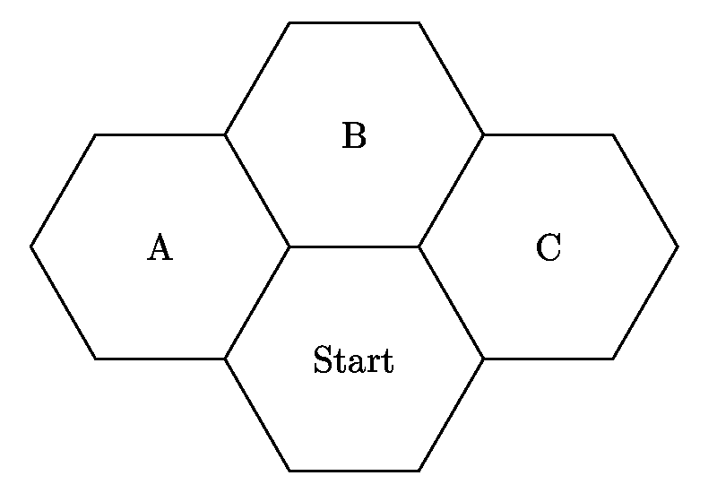
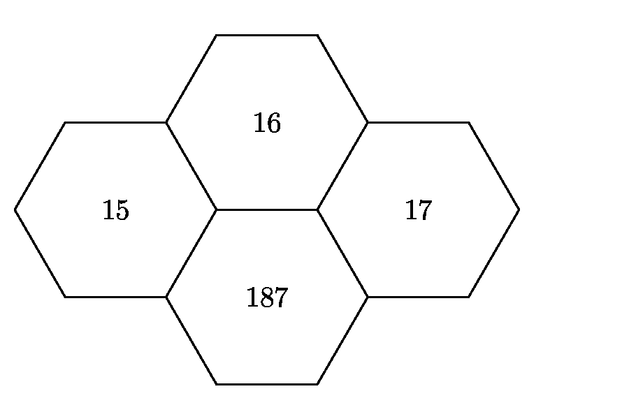
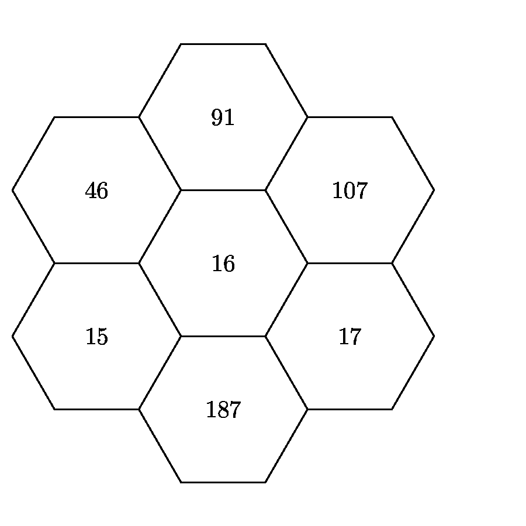
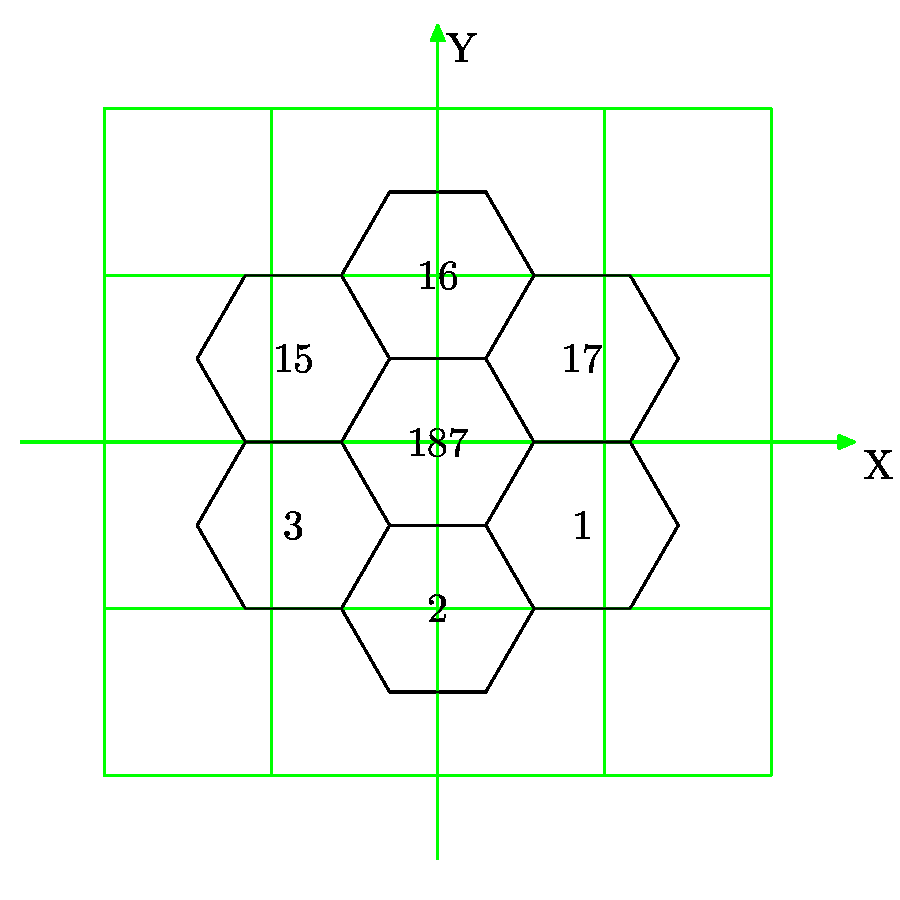
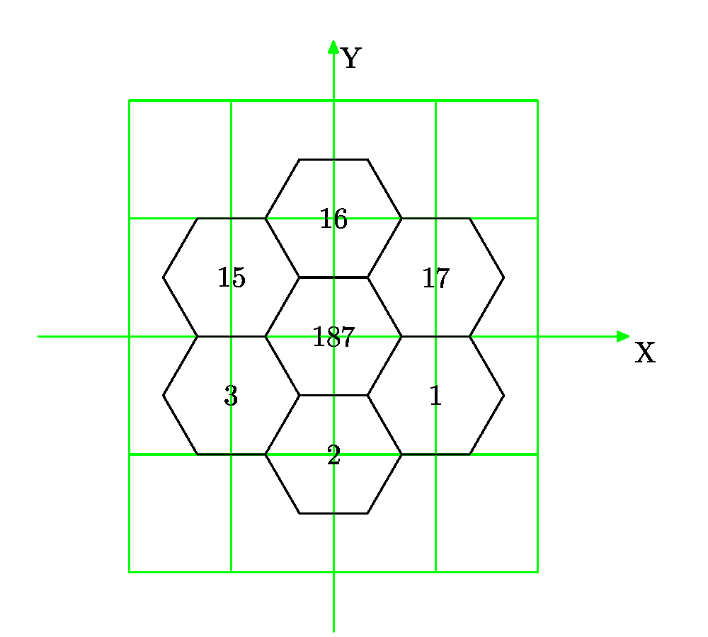
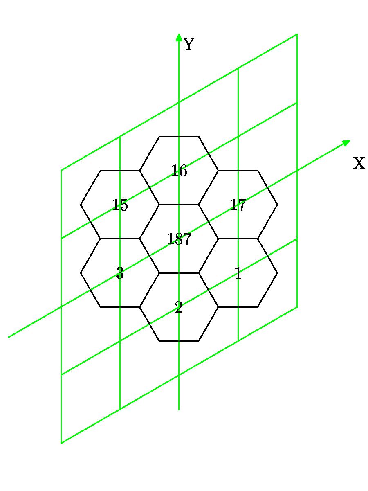

# INTRODUCTION

The programs for playing _Ace of Aces_ rely on a transition table
listing the transitions (start page, maneuver) → end page, stored in
a JSON file. We can type this JSON file by copying the 222-page
booklet, with 25 maneuvers per page for _Handy Rotary_, that is, 5550
entries. This is boring and error-prone. And you have to do this for
at least two booklets. Even with _Wingleader_ and 13 maneuvers per
page, that amounts to 2886 entries for each booklet.

Fortunately, the different pages represent the location and heading of a 
plane on a 37-hexagon grid, with 6 possible headings. By using this
underlying geometry, we can just copy a significant subset of transitions
(start page, maneuver) → end page and generate the other transitions by geometrical
computation and by inference.

Additionally, all the games of the series use the same 37-hexagon grid with
the same numbering. So, you have to build an electronic version of the
37-hexagon grid only once, and then you can initialize any booklet by 
specifying the 13 to 26 maneuvers (plus the fire table, which is harder to
compute).

So I built the electronic version of the hex-grid using the FW190 booklet
from _Wingleader_, then I checked it by generating the booklets for
the Sopwith Camel and the Fokker DR1 from _Handy Rotary_ and for the 
P-51 and the FW190 from _Wingleader_. I also generated booklets for
a new game involving a sparrowhawk and a hobbyist's drone.

## Warning

When I wrote the programs, I used French names for the programs, for
the variables, for the functions etc. Sorry about that, if you want to
read my programs, you will need to learn French in addition to Raku.

# SPARROWHAWK vs. HOBBYIST DRONE

For copyright reasons, I do not want to publish on Github the JSON files
for the Sopwith Camel, the Fokker DR1, the P-51 Mustang and the FW190.
The patent has expired, but not the copyright on _Handy Rotary_ and
_Wingleader_. So I created a game "sparrowhawk vs. hobbyist drone",
after recent incident reports describing brutal encounters between
birds of prey and drones. In the game, the drone tries to film the bird, while the
bird tries to destroy the drone.

While most animals and most vehicules on Earth have a front / back
orientation, the drone, a quadcopter, has no real orientation for its
movements, a bit like jellyfish and sea anemones. It can move
backward or sideways as easily as forward. It still has a front / back
orientation, because I consider that the camera is rigidly fixed on
the drone frame, so the front of the drone is the camera field of view.

I do not pretend that the game is interesting, especially since I do not
provide the pictures which are an important element for human players.
I do not pretend either it is balanced. But the game has been created by me,
so I am entitled to publish it on Github or elsewhere under any free license I choose.

In the following, I describe the preparation as if I had used the "Drone" booklet
since the beginning.

# STEPS

## Typing

Using your preferred text editor, write a `Drone-init.json` file. This file
describes the maneuvers the drone can execute and the pages where it can 
"shoot" at the sparrowhawk (actually shooting film). The file does not contain
any transition (start page, maneuver) → endpage.

## Initialization

The `init.p6` program initializes or resets a `aoa_prep` MongoDB database.

Then it copies the contents of `Drone-init.json` in a `Manoeuvres` 
collection (French for "maneuvers"). And it initializes another collection,
`Pages`, with only two pages: page 223, which has a special status and
page 187, an ordinary page from which we will bootstrap the geometrical description.

The choice of page 187 is partly an abritrary one. This is the page
where both planes are in the same hex with the same heading. But I could have
bootstraped the process with any other ordinary page.

## Incremental Update

"Update" translates to _mise à jour_ in French, so the update program
is named `maj.p6`. This is a command-line program, which receives as
input parameters a page number, plus the transitions maneuver → end
page. For example, the first time it will run, the command line will
be:

    perl6 maj.p6 --page=187 -a=205 -b=187 -c=198 -d=3 -e=15 -f=16 -g=2 -h=17 -i=1

That means that when the start page is page 187, the end page for maneuver `"A"`
is page 205, the end page for maneuver `"B"` is page 187 and so on.
If the command line parameters include an unknown page, the program
creates it in the `Pages` collection, initializing its position in the
hexgrid and the heading of the plane (or drone, or bird, or...).

In addition, the program takes the new pages and applies all the maneuvers
to them. If the result is a known page, the transition maneuver → end page
is stored in `Pages` collection. If the end page is not known yet, no update
takes place.

The program also applies _backward_ the maneuvers to new pages to check other
transitions (start page, maneuver) → end page, where the end page is the page
currently processed and the start page is hopefully a page already known.

This backward processing did not exist in the first version, in March 2018, I added it in
June 2018. Instead, I had a paramter triggering a full computation, for all known
pages, old and new alike. Very time-consuming.

### Example

Let us consider a flying machine with fewer maneuvers than the drone. The only
three maneuvers are:

- Maneuver A, a port sideslip to the hex at 10 o'clock without heading change
- Maneuver B, move forward
- Maneuver C, a starboard sideslip to the hex at 2 o'clock without heading change

_Personal picture. License is the same as for the text._

After `init.p6`, the only known page is 187 (except for page 223, a special one).
So the first run of `maj.p6` is:

    perl6 maj.p6 -page=187 -a=15 -b=16 -c=17

The program updates the transitions with:

    (187, A) → 15
    (187, B) → 16
    (187, C) → 17

And the map is filled with:

_Personal picture. License is the same as for the text._

The program processes the newly created pages, 15, 16 and 17 and applies the
maneuvers A, B and C to them. With three hexes and three maneuvers, it makes
nine attempts, two of which succeed. With that, the program adds the transitions:

    ( 15, C) → 16
    ( 17, A) → 16

The second call to `maj.p6` applies to page 16:

    perl6 maj.p6 -page=16  -a=46 -b=91 -c=107

The program updates the transitions with:

    ( 16, A) →  46
    ( 16, B) →  91
    ( 16, C) → 107

And the map expands with:

Like the first time, the program applies the maneuvers to the newly
created pages, with 9 attempts, 7 of which fail and 2 of which succeed.
So the following transitions are added:

    ( 46, C) → 91
    (107, A) → 91

In addition, the program applies the maneuvers backward to the newly
created pages. The result gives some already known transitions:

    (x, A) →  46 with x =  16
    (x, A) →  91 with x = 107
    (x, B) →  91 with x =  16
    (x, C) →  91 with x =  46
    (x, C) → 107 with x =  16

Some attempts fail:

    (x, C) →  46
    (x, A) → 107

And some attempts give new results

    (x, B) →  46 with x = 15
    (x, B) → 107 with x = 17

So the following records are added:

    ( 15, B) →  46
    ( 17, B) → 107

### Iterations

The program `maj.p6` is called enough times to get all transitions
for all pages and all maneuvers. Since the drone has 9 maneuvers, one
of which is immobility, only 8 maneuvers may give new results. So we
need at least 222/8 calls, that is 28 calls. Since there is some
overlay, I ended up with 48 calls. There was perhaps a faster
solutionn but I doubt there could be a much faster solution.

## Display

"Display" translates as _Affichage_, so the program name is `aff.p6`.
This program generates an HTML table listing all the known pages
and transitions. It displays also an ASCII art hexgrid, showing all
known page numbers, with the sparrowhawk at the center of the grid 
and heading to the top of the document, and the drone anywhere in the
grid and with any heading. This helps me choosing the next page I will use
when running `maj.p6`, because it is more efficient to use a page
with 2 known transitions and 7 unknown transitions than a page
with 7 known transitions and 2 unknown transitions.

Here are two examples, the first one
[after the update of page 187](https://github.com/jforget/Perl6-Alpha-As-des-As-Zero/blob/master/Preparation/etape1.pod)
and the second when
[the hexgrid is complete](https://github.com/jforget/Perl6-Alpha-As-des-As-Zero/blob/master/Preparation/etape-finale.pod).
Please note that the display should give you background colors, but they are stripped by Github rendering.

## Booklet Generation

"Booklet" translates as _livret_, so the program is named `livret.p6`.

The iterative process ends when every page has been mentioned at least once
in the parameters of `maj.p6`, that is, when the hexgrid is entirely known.

At this time, we can generate a booklet for any flying machine or any flying
creature. The program `livret.p6` reads a small size `Sparrowhawk-init.json`
file and generates a full size `Sparrowhawk.json` file, plus a more user-friendly
`Sparrowhawk.html`, both of which contain the full list of transitions
(start page, maneuver) → end page.

# IMPLEMENTATION

## The `Depl.pm6` Class

A central question for the preparation programs is how to modelize
the relative position of two aircraft, be it the position of the
drone relative to the sparrowhawk, or the final position of the drone
relative to its start position, when it executes a maneuver. For this,
I have created the `Depl.pm6` class, "depl" for _déplacement_ or "move".
It represents the move of the drone while maneuvering, from its start position
to its end position, or it represents the virtual move to go from the 
sparrowhawk position to the drone position.

### Hexagon Coordinates

To implement this class, I need first to define how I will 
pinpoint each one of the 37 hexes in the grid. For the heading
difference, we will see later. So in this paragraph, I will 
use the words "page" and "hex" (or "hexagon") to mean the same
thing.

My first idea was to use orthonormal cartesian coordinates:

_Personal picture. License is the same as for the text._

    .                       -------- 
    .                      /        \               Number     X         Y
    .              --------    16    --------            2     0        -1
    .             /        \        /        \           3    -0.866    -0.5
    .            (    15    --------    17    )          1     0.866    -0.5
    .             \        /        \        /         187     0         0
    .              --------   187    --------           15    -0.866     0.5
    .             /        \        /        \          17     0.866     0.5
    .            (     3    --------     1    )         16     0         1
    .             \        /        \        /
    .              --------    2     -------- 
    .                      \        /
    .                       --------

Then orthogonal cartesian coordinates, while not orthonormal:

_Personal picture. License is the same as for the text._

    .                       -------- 
    .                      /        \               Number     X         Y
    .              --------    16    --------            2     0        -1
    .             /        \        /        \           3    -1        -0.5
    .            (    15    --------    17    )          1     1        -0.5
    .             \        /        \        /         187     0         0
    .              --------   187    --------           15    -1         0.5
    .             /        \        /        \          17     1         0.5
    .            (     3    --------     1    )         16     0         1
    .             \        /        \        /
    .              --------    2     -------- 
    .                      \        /
    .                       --------

Even a cartesian coordinate system where the axis have the same graduations,
but they are not perpendicular to each other, they are 60° (or 120°) apart.
Do not laugh, some 
[vintage Avalon Hill wargames](https://boardgamegeek.com/boardgame/1711/richthofens-war).
use this kind of coordinates.

_Personal picture. License is the same as for the text._

    .                       -------- 
    .                      /        \               Number     X         Y
    .              --------    16    --------            2     0        -1
    .             /        \        /        \           1     1        -1
    .            (    15    --------    17    )          3    -1         0
    .             \        /        \        /         187     0         0
    .              --------   187    --------           17     1         0
    .             /        \        /        \          15    -1         1
    .            (     3    --------     1    )         16     0         1
    .             \        /        \        /
    .              --------    2     -------- 
    .                      \        /
    .                       --------

Polar coordinates seems to be a better approach. Actually, it is similar to the
clock system in use with WWII pilots.

    .                       -------- 
    .                      /        \               Number     R      angle
    .              --------    16    --------          187     0      undef
    .             /        \        /        \          16     1        12h
    .            (    15    --------    17    )         17     1         2h
    .             \        /        \        /           1     1         4h
    .              --------   187    --------            2     1         6h
    .             /        \        /        \           3     1         8h
    .            (     3    --------     1    )         15     1        10h
    .             \        /        \        /
    .              --------    2     -------- 
    .                      \        /
    .                       --------

For simplification, I have used clockwise 60-degree increments, which gives a 0 to 5 range.
The conversion from the clock system is rather simple, you just have to divide by 2,
except for 12h which gives **0** instead of **6**.

It is very fine for the first ring, but we have a few problems as soon as we
reach the second ring, the radiuses are no longer integers, even if the
angles are still simple angles, multiples of 30°.

    .                       -------- 
    .                      /        \               Number     R      angle
    .              --------    91    --------          187     0      undef
    .             /        \        /        \          16     1        12h    0°
    .     --------   118    --------   107    )         17     1         2h   60°
    .    /        \        /        \        /           1     1         4h  120°
    .   (    54    --------    16    --------            2     1         6h  180°
    .    \        /        \        /        \           3     1         8h  240°
    .     --------    15    --------    17    )         15     1        10h  300°
    .    /        \        /        \        /          54     2        10h  300°
    .   (    76    --------   187    --------           76     1.732     9h  270°
    .    \        /        \        /        \          91     2         0h  240°
    .     --------     3    --------     1    )        107     1.732     1h   30°
    .             \        /        \        /         118     1.732    11h  330°
    .              --------    2     --------          
    .                      \        /
    .                       --------

To deal with simpler values, we consider that the move is not executed
in a straight line, but step by step and crossing intermediate hexagons,
even if that means that we zigzag a little. A move is thus modelized as
a series of directions `0` to `5`, the length of each step being implicitly 1.
Here are the paths from hex 187:

    .                       -------- 
    .                      /        \               Number     path
    .              --------    91    --------          187     (nothing)
    .             /        \        /        \          16     0
    .     --------   118    --------   107    )         17     1
    .    /        \        /        \        /           1     2
    .   (    54    --------    16    --------            2     3
    .    \        /        \        /        \           3     4
    .     --------    15    --------    17    )         15     5
    .    /        \        /        \        /          54     55
    .   (    76    --------   187    --------           76     45
    .    \        /        \        /        \          91     00
    .     --------     3    --------     1    )        107     01
    .             \        /        \        /         118     05
    .              --------    2     --------          
    .                      \        /
    .                       --------

And we obtain the geometry that most wargamers are used to, which shows
that from hex 187 to hex 76, the distance is 2, not 1.732.

In all that, I have not dealt with the heading difference. We use the
same angle scale `0` to `5`, but without mixing it with the path.
If the planes have a common heading as in page 1 from the example from
the patent, the heading diff is `0`. But on page 8, the heading
diff of the German relative to the British is `5`.

### Internal Representation

The class uses two different models for a move, a string model and a numeric
model. The string is the concatenation of the path steps from the sparrowhawk's
position (or the British plane's position) to the drone's position (or the German plane's
position), then you have a semi-colon, and last you have 
the heading difference between the sparrowhawk and the drone. For example,
page 1 has the following representation:

    2;0

Because the drone's hexagon is in the heading `2` respective to the sparrowhawk's hex
and they have the same heading. At the same time, page 8 has the following representation:

    2;5

because the hexagon is the same, but the drone has turned 60° to port. This string is
stored in the attribute `$.chemin` (_chemin_ = "path").

The numeric representation includes an array `@.avance` (= "advance") and a scalar
`$.virage` (= "turn"). The scalar `$.virage` stores the heading difference between
both planes. The array `@.avance` counts the number of steps in each direction

    page         1     8     42     48     96     159
    $.chemin     2;0   2;5   00;1   33;1   33;0   112;1
    @.avance[0]  0     0     2      0      0      0
    @.avance[1]  0     0     0      0      0      2
    @.avance[2]  1     1     0      0      0      1
    @.avance[3]  0     0     0      2      2      0
    @.avance[4]  0     0     0      0      0      0
    @.avance[5]  0     0     0      0      0      0
    $.virage     0     5     1      1      0      1

### Special Cases

Among the 222 pages, 6 of them represent the situation where both planes are in
the same hex, one above the other (the only case when altitude plays a role).
In this case, all `@.avance` values are zero and the `$.chemin` string begins
with a semi-colon. Page 187 represents the planes in the same hex, one above the
other, and with the same heading, so `$.chemin` is `";0"`. Page 188 represents
the planes in the same hex, one above the other, but this time with reciprocal headings.
So `$.chemin` is `";3"`.

# License

This text is published under the CC-BY-NC-ND license: Attribution-NonCommercial-NoDerivs 2.0 Generic.
